# 🏦OpenSight


## 🗓️프로젝트 진행기간


SSAFY 10기 특화 프로젝트

기간 : 2024.02.26. ~ 2024.04.04

### 서비스 소개


모두를 위한 금융 서비스, **OpenSight**

시각장애인뿐만 아니라 비장애인 모두가 사용할 수 있는 금융 서비스

### 🎆주요 기능


- 은행 계좌 생성 및 거래 내역 조회, 계좌 이체
- Amazon Rekognition을 활용한 로그인 및 계좌 이체 인증
- LLM 모델을 활용한 대화형 챗봇을 텍스트 혹은 음성을 통해 편리한 은행 서비스 이용

### 서비스 화면
|인트로1|인트로2|인트로3|인트로4|인트로5|
|---|---|---|---|---|
|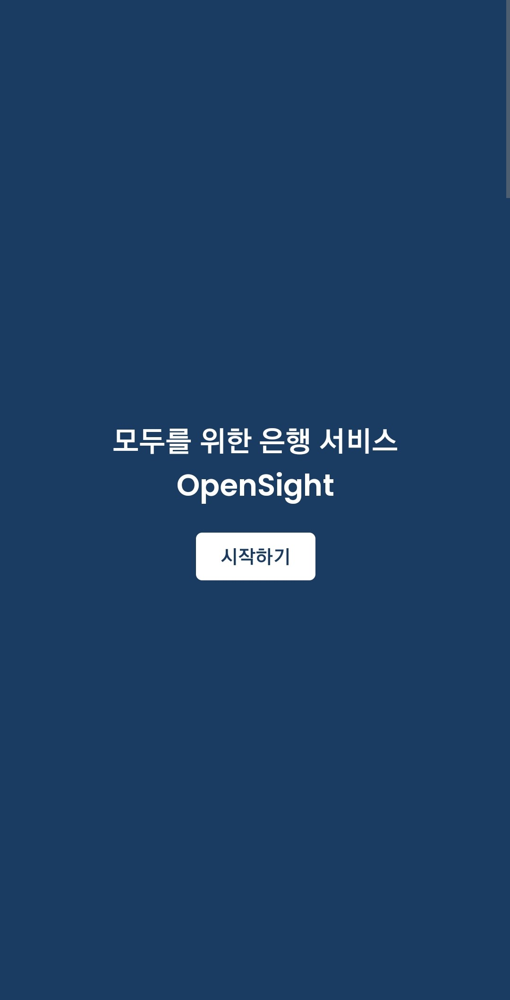|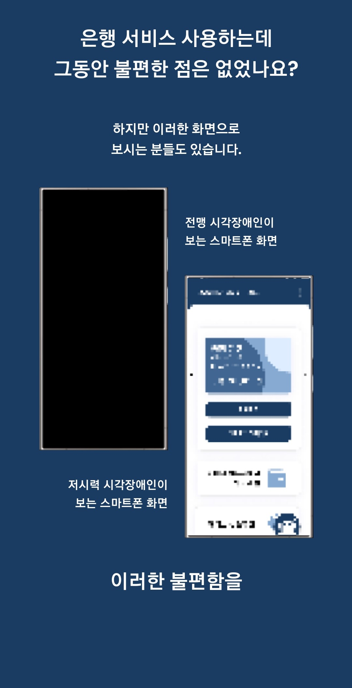|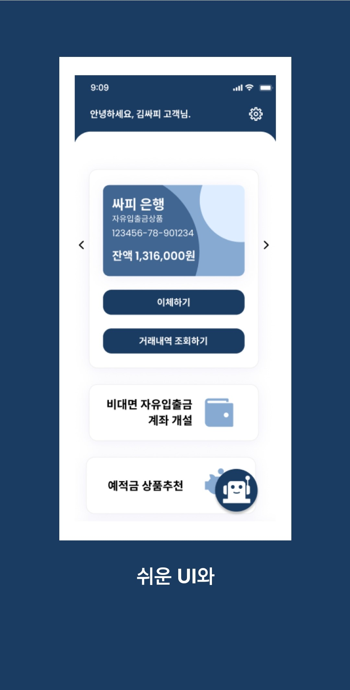|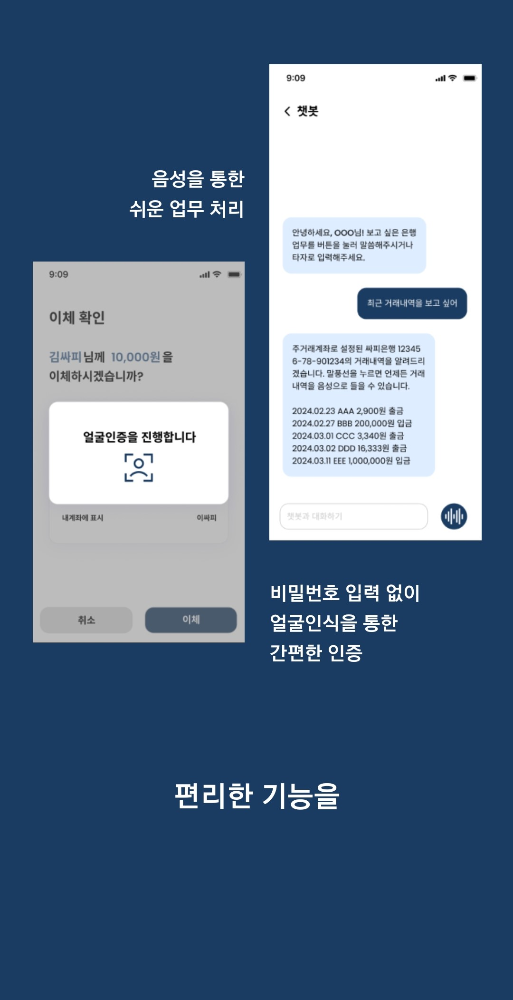||

|로그인|회원가입|
|---|---|
|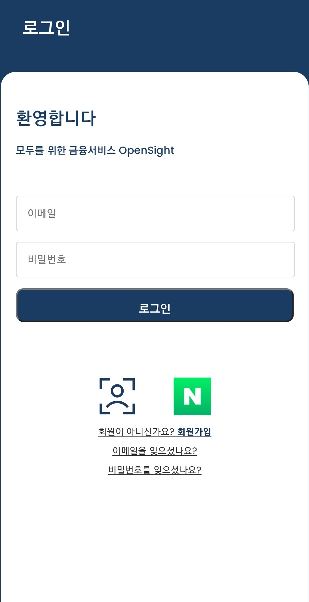|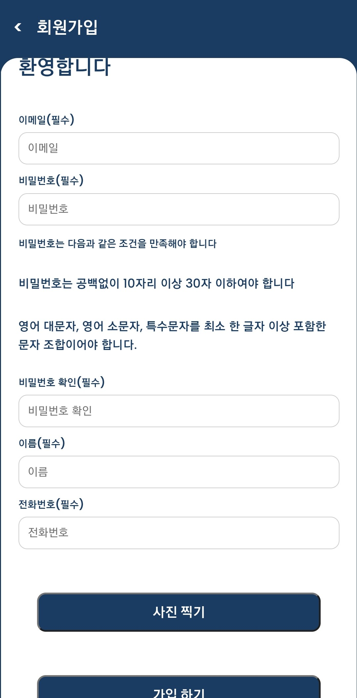|

|이메일찾기|비밀번호찾기|
|---|---|
|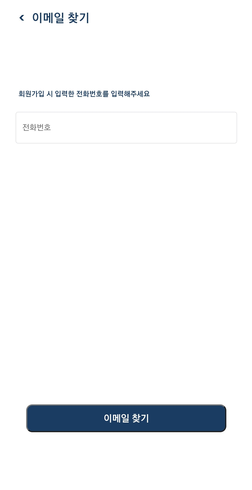|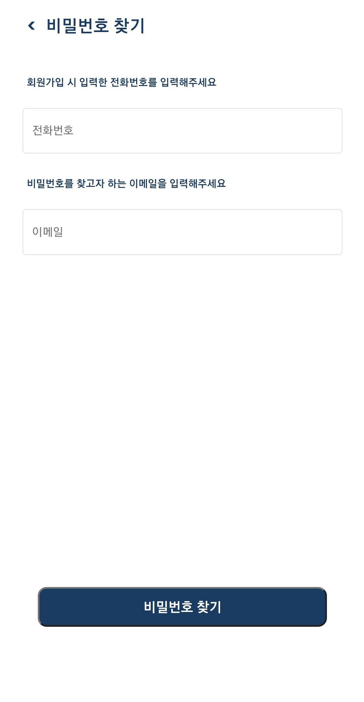||

|메인페이지|챗봇|
|---|---|
|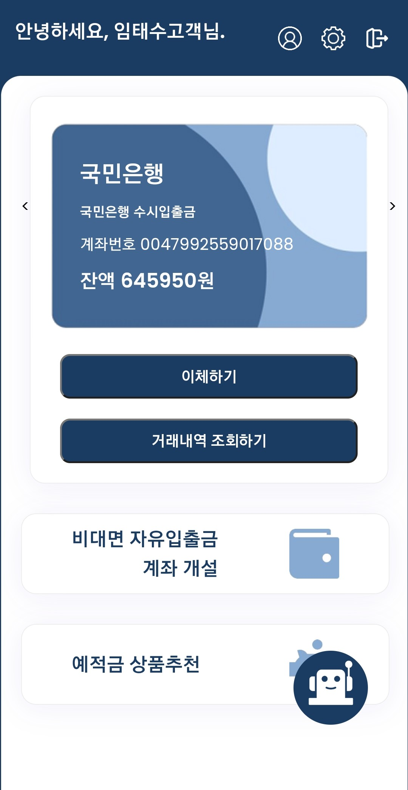||

|계좌이체입력|계좌이체확인|간편비밀번호|계좌이체완료|
|---|---|---|---|
|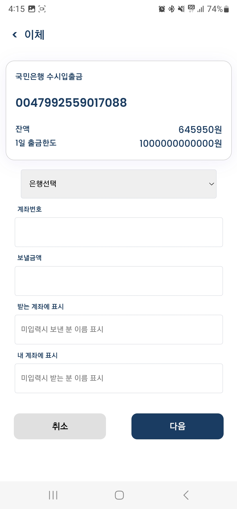|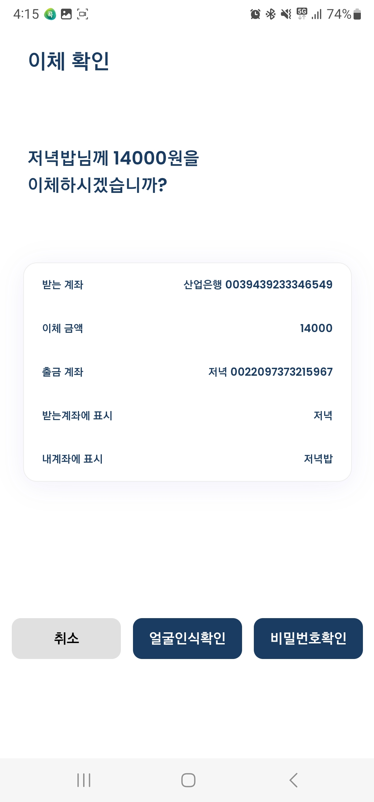|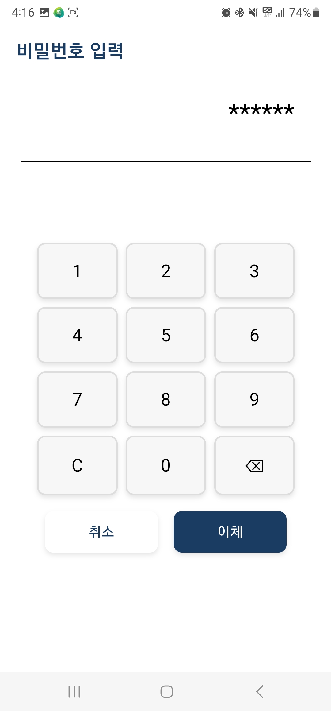|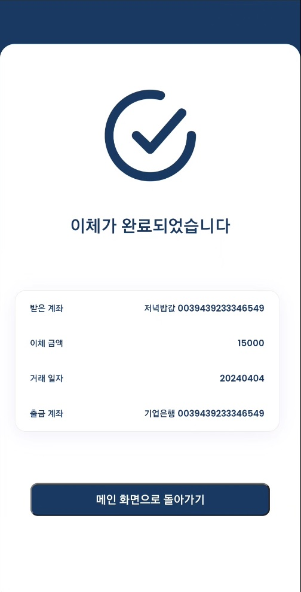|

|거래내역조회|
|---|
|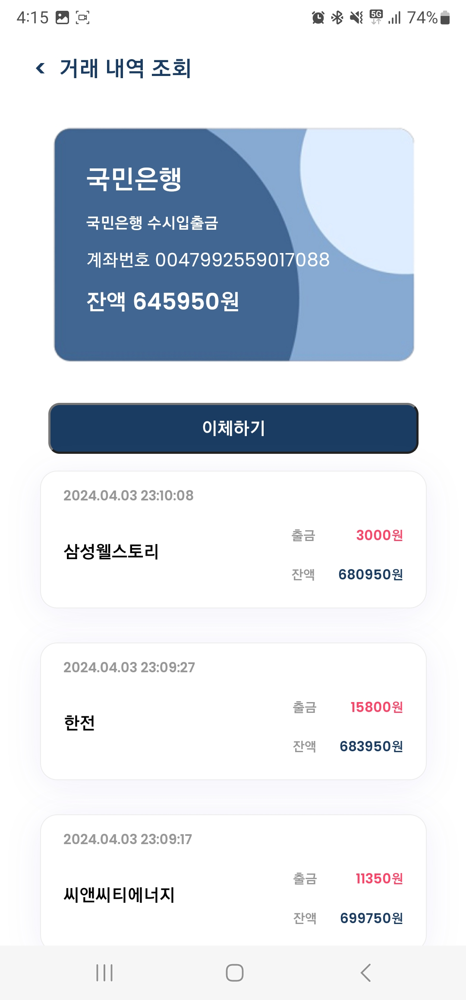|

|비대면계좌개설|약관동의|계좌개설완료|
|---|---|---|
|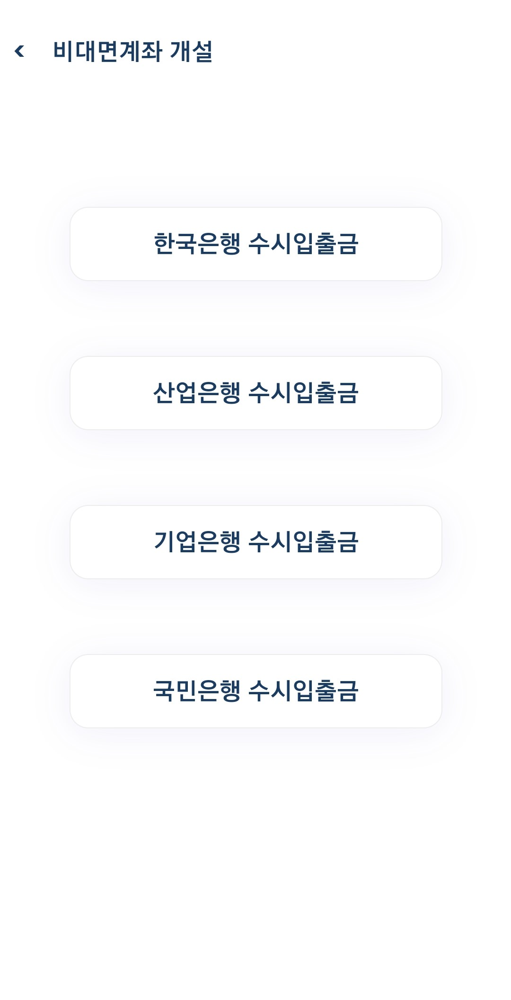|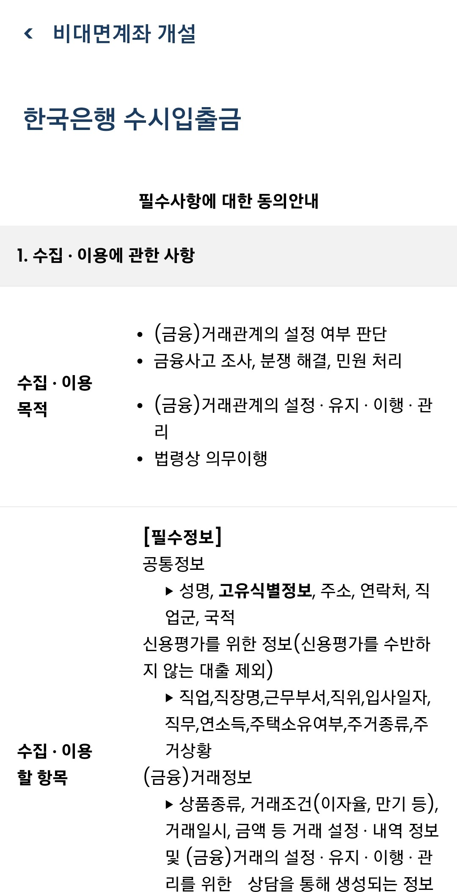||

|회원정보수정|간편비밀번호설정|주거래통장설정|
|---|---|---|
||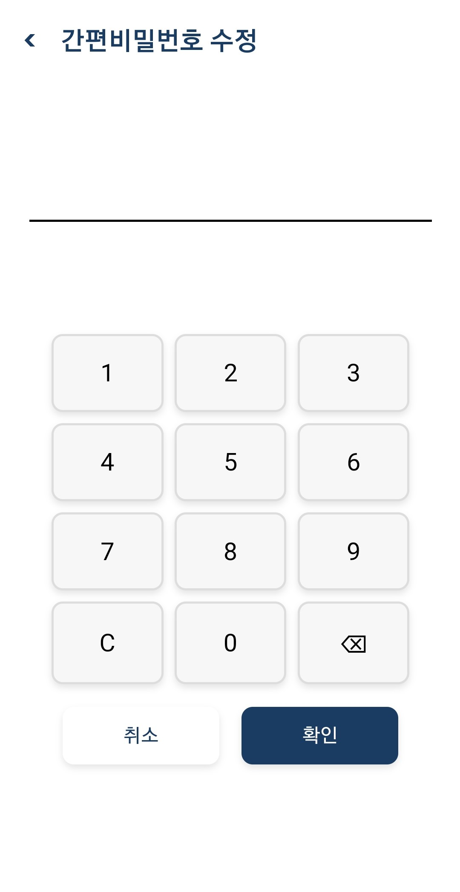|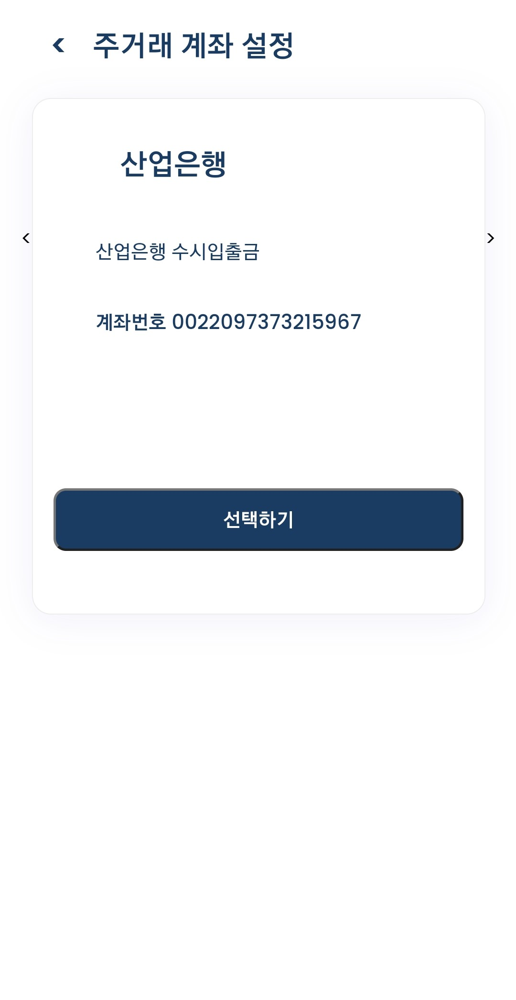|


### 팀원
|임지현|김혜지|류진호|오치승|임태수|
|---|---|---|---|--|
|팀장, FE, AI|BE, FE|BE Leader, FE|Infra, FE|FE Leader, UI/UX|

#### 역할
임지현
- 팀장
- 중간, 최종 발표
- Infra
  - Gerrit 및 Gitlab Gitflow 환경 구축
  - Jira 일정 관리
- AI
  - LLM 모델 생성 매개변수 조정
  - 프롬프트 엔지니어링
  - Django 서버 구축
- Frontend 개발
  - UI/UX 피그마 디자인
  - 음성 인식 기술 구현
  - 챗봇 화면 구현

김혜지
- ERD, API 설계
- Backend 개발
  - 네이버 소셜 로그인 구현
  - jwt 로그인 구현
  - 유저 관리 및 간편 계좌 등록 및 확인
  - Spring에서 챗봇 로직 구현
- Frontend 개발
  - 유저 로그인, 회원가입 페이지 연동
  - 계좌이체 페이지 연동
  - 비대면 계좌 개설 페이지 연동

류진호
- ERD, API 설계
- Backend 개발
  - 일반 로그인 구현
  - 얼굴 인식(Amazon Rekognition) 로그인 및 이체 확인 구현
  - 뱅킹 시스템(계좌조회, 이체, 생성, 내역조회) 구현
- Frontend 개발
  - 유저 로그인, 회원가입 페이지 연동
  - 계좌이체 페이지 연동
  - 비대면 계좌 개설 페이지 연동

오치승
- Infra
  - Gitlab CI/CD를 통한 자동 테스트 및 배포 pipeline 구현
  - MSA 환경 아키텍쳐 구축
  - https 통한 reverse proxy 구현
- Frontend 개발
  - 로그인/회원가입 연동
  - 거래내역 조회 기능 구현
  - 로그아웃 페이지 연동

임태수
- Infra
  - Gerrit 및 Gitlab Gitflow 환경 구축
- Frontend
  - UI/UX 피그마 디자인
  - 페이지 컴포넌트 설계
  - 페이지 CSS 디자인
  - 페이지 라우팅 설계
  - 라우터 가드 구현
- UCC 제작

## 🛠기술스택


### BackEnd

&nbsp;
&nbsp;
&nbsp;
&nbsp;

- Java JDK 17
- SpringBoot 3.2.2
- JPA 3.2.2
- Gradle 8.4
- MySQL 8.0.30

### FrontEnd

&nbsp;
&nbsp;
&nbsp;

- Vue 3.4.21
- Node.js 20.11.0
- javascript ES6

### AI

&nbsp;
&nbsp;
&nbsp;

- Python 3.9.13
- Django 4.2.11
- Pytorch 1.11.0

### CI/CD

&nbsp;
&nbsp;
&nbsp;
&nbsp;

- AWS EC2
- Ubuntu 20.0.4 LTS
- nginx 1.18.0
- Docker

### 협업 툴

&nbsp;
&nbsp;
&nbsp;
&nbsp;
&nbsp;
&nbsp;

- Git
- Jira
- Mattermost
- Notion
- Figma
- gerrit


## 프로젝트 파일 구조


<details>
<summary>backend</summary>
<div markdown="1">

```
📦backend
 ┣ 📂build
 ┃ ┣ 📂classes
 ┃ ┃ ┗ 📂java
 ┃ ┃ ┃ ┣ 📂main
 ┃ ┃ ┃ ┃ ┗ 📂org
 ┃ ┃ ┃ ┃ ┃ ┗ 📂example
 ┃ ┃ ┃ ┃ ┃ ┃ ┗ 📂b104
 ┃ ┃ ┃ ┃ ┃ ┃ ┃ ┣ 📂domain
 ┃ ┃ ┃ ┃ ┃ ┃ ┃ ┃ ┣ 📂account
 ┃ ┃ ┃ ┃ ┃ ┃ ┃ ┃ ┃ ┣ 📂controller
 ┃ ┃ ┃ ┃ ┃ ┃ ┃ ┃ ┃ ┃ ┣ 📂clirequest
 ┃ ┃ ┃ ┃ ┃ ┃ ┃ ┃ ┃ ┃ ┃ ┣ 📜cliAccountTransferRequest$cliAccountTransferRequestBuilder.class
 ┃ ┃ ┃ ┃ ┃ ┃ ┃ ┃ ┃ ┃ ┃ ┣ 📜cliAccountTransferRequest.class
 ┃ ┃ ┃ ┃ ┃ ┃ ┃ ┃ ┃ ┃ ┃ ┣ 📜cliDrawingTransferRequest$cliDrawingTransferRequestBuilder.class
 ┃ ┃ ┃ ┃ ┃ ┃ ┃ ┃ ┃ ┃ ┃ ┣ 📜cliDrawingTransferRequest.class
 ┃ ┃ ┃ ┃ ┃ ┃ ┃ ┃ ┃ ┃ ┃ ┣ 📜cliInquireAccountBalanceRequest$cliInquireAccountBalanceRequestBuilder.class
 ┃ ┃ ┃ ┃ ┃ ┃ ┃ ┃ ┃ ┃ ┃ ┣ 📜cliInquireAccountBalanceRequest.class
 ┃ ┃ ┃ ┃ ┃ ┃ ┃ ┃ ┃ ┃ ┃ ┣ 📜cliInquireAccountInfoRequest$cliInquireAccountInfoRequestBuilder.class
 ┃ ┃ ┃ ┃ ┃ ┃ ┃ ┃ ┃ ┃ ┃ ┣ 📜cliInquireAccountInfoRequest.class
 ┃ ┃ ┃ ┃ ┃ ┃ ┃ ┃ ┃ ┃ ┃ ┣ 📜cliInquireAccountListRequest$cliInquireAccountListRequestBuilder.class
 ┃ ┃ ┃ ┃ ┃ ┃ ┃ ┃ ┃ ┃ ┃ ┣ 📜cliInquireAccountListRequest.class
 ┃ ┃ ┃ ┃ ┃ ┃ ┃ ┃ ┃ ┃ ┃ ┣ 📜cliInquireAccountTransactionHistoryRequest$cliInquireAccountTransactionHistoryRequestBuilder.class
 ┃ ┃ ┃ ┃ ┃ ┃ ┃ ┃ ┃ ┃ ┃ ┣ 📜cliInquireAccountTransactionHistoryRequest.class
 ┃ ┃ ┃ ┃ ┃ ┃ ┃ ┃ ┃ ┃ ┃ ┣ 📜cliInquireBankAccountTypesRequest$cliInquireBankAccountTypesRequestBuilder.class
 ┃ ┃ ┃ ┃ ┃ ┃ ┃ ┃ ┃ ┃ ┃ ┣ 📜cliInquireBankAccountTypesRequest.class
 ┃ ┃ ┃ ┃ ┃ ┃ ┃ ┃ ┃ ┃ ┃ ┣ 📜cliInquireDepositorAccountNumberRequest$cliInquireDepositorAccountNumberRequestBuilder.class
 ┃ ┃ ┃ ┃ ┃ ┃ ┃ ┃ ┃ ┃ ┃ ┣ 📜cliInquireDepositorAccountNumberRequest.class
 ┃ ┃ ┃ ┃ ┃ ┃ ┃ ┃ ┃ ┃ ┃ ┣ 📜cliInquireTransactionHistoryDetailRequest$cliInquireTransactionHistoryDetailRequestBuilder.class
 ┃ ┃ ┃ ┃ ┃ ┃ ┃ ┃ ┃ ┃ ┃ ┣ 📜cliInquireTransactionHistoryDetailRequest.class
 ┃ ┃ ┃ ┃ ┃ ┃ ┃ ┃ ┃ ┃ ┃ ┣ 📜cliOpenAccountRequest$cliOpenAccountRequestBuilder.class
 ┃ ┃ ┃ ┃ ┃ ┃ ┃ ┃ ┃ ┃ ┃ ┣ 📜cliOpenAccountRequest.class
 ┃ ┃ ┃ ┃ ┃ ┃ ┃ ┃ ┃ ┃ ┃ ┣ 📜cliReceivedTransferAccountNumberRequest$cliReceivedTransferAccountNumberRequestBuilder.class
 ┃ ┃ ┃ ┃ ┃ ┃ ┃ ┃ ┃ ┃ ┃ ┗ 📜cliReceivedTransferAccountNumberRequest.class
 ┃ ┃ ┃ ┃ ┃ ┃ ┃ ┃ ┃ ┃ ┣ 📂record
 ┃ ┃ ┃ ┃ ┃ ┃ ┃ ┃ ┃ ┃ ┃ ┣ 📜AccountTransferRecord.class
 ┃ ┃ ┃ ┃ ┃ ┃ ┃ ┃ ┃ ┃ ┃ ┣ 📜DrawingTransferRecord.class
 ┃ ┃ ┃ ┃ ┃ ┃ ┃ ┃ ┃ ┃ ┃ ┣ 📜InquireAccountBalanceRecord.class
 ┃ ┃ ┃ ┃ ┃ ┃ ┃ ┃ ┃ ┃ ┃ ┣ 📜InquireAccountHistoryRecord.class
 ┃ ┃ ┃ ┃ ┃ ┃ ┃ ┃ ┃ ┃ ┃ ┣ 📜InquireAccountInfoRecord.class
 ┃ ┃ ┃ ┃ ┃ ┃ ┃ ┃ ┃ ┃ ┃ ┣ 📜InquireAccountListRecord.class
 ┃ ┃ ┃ ┃ ┃ ┃ ┃ ┃ ┃ ┃ ┃ ┣ 📜InquireDepositorAccountNumberRecord.class
 ┃ ┃ ┃ ┃ ┃ ┃ ┃ ┃ ┃ ┃ ┃ ┣ 📜InquireTransactionHistoryDetailRecord.class
 ┃ ┃ ┃ ┃ ┃ ┃ ┃ ┃ ┃ ┃ ┃ ┣ 📜ReceivedTransferAccountNumberRecord.class
 ┃ ┃ ┃ ┃ ┃ ┃ ┃ ┃ ┃ ┃ ┃ ┗ 📜SingleAccountTransactionHistory.class
 ┃ ┃ ┃ ┃ ┃ ┃ ┃ ┃ ┃ ┃ ┣ 📂request
 ┃ ┃ ┃ ┃ ┃ ┃ ┃ ┃ ┃ ┃ ┃ ┣ 📜AccountRequestHeader$AccountRequestHeaderBuilder.class
 ┃ ┃ ┃ ┃ ┃ ┃ ┃ ┃ ┃ ┃ ┃ ┣ 📜AccountRequestHeader.class
 ┃ ┃ ┃ ┃ ┃ ┃ ┃ ┃ ┃ ┃ ┃ ┣ 📜AccountTransferRequest$AccountTransferRequestBuilder.class
 ┃ ┃ ┃ ┃ ┃ ┃ ┃ ┃ ┃ ┃ ┃ ┣ 📜AccountTransferRequest.class
 ┃ ┃ ┃ ┃ ┃ ┃ ┃ ┃ ┃ ┃ ┃ ┣ 📜DrawingTransferRequest$DrawingTransferRequestBuilder.class
 ┃ ┃ ┃ ┃ ┃ ┃ ┃ ┃ ┃ ┃ ┃ ┣ 📜DrawingTransferRequest.class
 ┃ ┃ ┃ ┃ ┃ ┃ ┃ ┃ ┃ ┃ ┃ ┣ 📜InquireAccountBalanceRequest$InquireAccountBalanceRequestBuilder.class
 ┃ ┃ ┃ ┃ ┃ ┃ ┃ ┃ ┃ ┃ ┃ ┣ 📜InquireAccountBalanceRequest.class
 ┃ ┃ ┃ ┃ ┃ ┃ ┃ ┃ ┃ ┃ ┃ ┣ 📜InquireAccountInfoRequest$InquireAccountInfoRequestBuilder.class
 ┃ ┃ ┃ ┃ ┃ ┃ ┃ ┃ ┃ ┃ ┃ ┣ 📜InquireAccountInfoRequest.class
 ┃ ┃ ┃ ┃ ┃ ┃ ┃ ┃ ┃ ┃ ┃ ┣ 📜InquireAccountListRequest$InquireAccountListRequestBuilder.class
 ┃ ┃ ┃ ┃ ┃ ┃ ┃ ┃ ┃ ┃ ┃ ┣ 📜InquireAccountListRequest.class
 ┃ ┃ ┃ ┃ ┃ ┃ ┃ ┃ ┃ ┃ ┃ ┣ 📜InquireAccountTransactionHistoryRequest$InquireAccountTransactionHistoryRequestBuilder.class
 ┃ ┃ ┃ ┃ ┃ ┃ ┃ ┃ ┃ ┃ ┃ ┣ 📜InquireAccountTransactionHistoryRequest.class
 ┃ ┃ ┃ ┃ ┃ ┃ ┃ ┃ ┃ ┃ ┃ ┣ 📜InquireBankAccountTypesRequest$InquireBankAccountTypesRequestBuilder.class
 ┃ ┃ ┃ ┃ ┃ ┃ ┃ ┃ ┃ ┃ ┃ ┣ 📜InquireBankAccountTypesRequest.class
 ┃ ┃ ┃ ┃ ┃ ┃ ┃ ┃ ┃ ┃ ┃ ┣ 📜InquireDepositorAccountNumberRequest$InquireDepositorAccountNumberRequestBuilder.class
 ┃ ┃ ┃ ┃ ┃ ┃ ┃ ┃ ┃ ┃ ┃ ┣ 📜InquireDepositorAccountNumberRequest.class
 ┃ ┃ ┃ ┃ ┃ ┃ ┃ ┃ ┃ ┃ ┃ ┣ 📜InquireTransactionHistoryDetailRequest$InquireTransactionHistoryDetailRequestBuilder.class
 ┃ ┃ ┃ ┃ ┃ ┃ ┃ ┃ ┃ ┃ ┃ ┣ 📜InquireTransactionHistoryDetailRequest.class
 ┃ ┃ ┃ ┃ ┃ ┃ ┃ ┃ ┃ ┃ ┃ ┣ 📜MakeManagerKeyRequest$MakeManagerKeyRequestBuilder.class
 ┃ ┃ ┃ ┃ ┃ ┃ ┃ ┃ ┃ ┃ ┃ ┣ 📜MakeManagerKeyRequest.class
 ┃ ┃ ┃ ┃ ┃ ┃ ┃ ┃ ┃ ┃ ┃ ┣ 📜OpenAccountRequest$OpenAccountRequestBuilder.class
 ┃ ┃ ┃ ┃ ┃ ┃ ┃ ┃ ┃ ┃ ┃ ┣ 📜OpenAccountRequest.class
 ┃ ┃ ┃ ┃ ┃ ┃ ┃ ┃ ┃ ┃ ┃ ┣ 📜ReceivedTransferAccountNumberRequest$ReceivedTransferAccountNumberRequestBuilder.class
 ┃ ┃ ┃ ┃ ┃ ┃ ┃ ┃ ┃ ┃ ┃ ┣ 📜ReceivedTransferAccountNumberRequest.class
 ┃ ┃ ┃ ┃ ┃ ┃ ┃ ┃ ┃ ┃ ┃ ┣ 📜RegisterAccountMemberRequest$RegisterAccountMemberRequestBuilder.class
 ┃ ┃ ┃ ┃ ┃ ┃ ┃ ┃ ┃ ┃ ┃ ┣ 📜RegisterAccountMemberRequest.class
 ┃ ┃ ┃ ┃ ┃ ┃ ┃ ┃ ┃ ┃ ┃ ┣ 📜SearchAccountMemberRequest$SearchAccountMemberRequestBuilder.class
 ┃ ┃ ┃ ┃ ┃ ┃ ┃ ┃ ┃ ┃ ┃ ┗ 📜SearchAccountMemberRequest.class
 ┃ ┃ ┃ ┃ ┃ ┃ ┃ ┃ ┃ ┃ ┣ 📂response
 ┃ ┃ ┃ ┃ ┃ ┃ ┃ ┃ ┃ ┃ ┃ ┣ 📜AccountResponseHeader$AccountResponseHeaderBuilder.class
 ┃ ┃ ┃ ┃ ┃ ┃ ┃ ┃ ┃ ┃ ┃ ┣ 📜AccountResponseHeader.class
 ┃ ┃ ┃ ┃ ┃ ┃ ┃ ┃ ┃ ┃ ┃ ┣ 📜AccountTransferResponse$AccountTransferResponseBuilder.class
 ┃ ┃ ┃ ┃ ┃ ┃ ┃ ┃ ┃ ┃ ┃ ┣ 📜AccountTransferResponse.class
 ┃ ┃ ┃ ┃ ┃ ┃ ┃ ┃ ┃ ┃ ┃ ┣ 📜DrawingTransferResponse$DrawingTransferResponseBuilder.class
 ┃ ┃ ┃ ┃ ┃ ┃ ┃ ┃ ┃ ┃ ┃ ┣ 📜DrawingTransferResponse.class
 ┃ ┃ ┃ ┃ ┃ ┃ ┃ ┃ ┃ ┃ ┃ ┣ 📜InquireAccountBalanceResponse$InquireAccountBalanceResponseBuilder.class
 ┃ ┃ ┃ ┃ ┃ ┃ ┃ ┃ ┃ ┃ ┃ ┣ 📜InquireAccountBalanceResponse.class
 ┃ ┃ ┃ ┃ ┃ ┃ ┃ ┃ ┃ ┃ ┃ ┣ 📜InquireAccountInfoResponse$InquireAccountInfoResponseBuilder.class
 ┃ ┃ ┃ ┃ ┃ ┃ ┃ ┃ ┃ ┃ ┃ ┣ 📜InquireAccountInfoResponse.class
 ┃ ┃ ┃ ┃ ┃ ┃ ┃ ┃ ┃ ┃ ┃ ┣ 📜InquireAccountListResponse$InquireAccountListResponseBuilder.class
 ┃ ┃ ┃ ┃ ┃ ┃ ┃ ┃ ┃ ┃ ┃ ┣ 📜InquireAccountListResponse.class
 ┃ ┃ ┃ ┃ ┃ ┃ ┃ ┃ ┃ ┃ ┃ ┣ 📜InquireAccountTransactionHistoryResponse$InquireAccountTransactionHistoryResponseBuilder.class
 ┃ ┃ ┃ ┃ ┃ ┃ ┃ ┃ ┃ ┃ ┃ ┣ 📜InquireAccountTransactionHistoryResponse.class
 ┃ ┃ ┃ ┃ ┃ ┃ ┃ ┃ ┃ ┃ ┃ ┣ 📜InquireBankAccountTypesResponse$InquireBankAccountTypesResponseBuilder.class
 ┃ ┃ ┃ ┃ ┃ ┃ ┃ ┃ ┃ ┃ ┃ ┣ 📜InquireBankAccountTypesResponse.class
 ┃ ┃ ┃ ┃ ┃ ┃ ┃ ┃ ┃ ┃ ┃ ┣ 📜InquireDepositorAccountNumberResponse$InquireDepositorAccountNumberResponseBuilder.class
 ┃ ┃ ┃ ┃ ┃ ┃ ┃ ┃ ┃ ┃ ┃ ┣ 📜InquireDepositorAccountNumberResponse.class
 ┃ ┃ ┃ ┃ ┃ ┃ ┃ ┃ ┃ ┃ ┃ ┣ 📜InquireTransactionHistoryDetailResponse$InquireTransactionHistoryDetailResponseBuilder.class
 ┃ ┃ ┃ ┃ ┃ ┃ ┃ ┃ ┃ ┃ ┃ ┣ 📜InquireTransactionHistoryDetailResponse.class
 ┃ ┃ ┃ ┃ ┃ ┃ ┃ ┃ ┃ ┃ ┃ ┣ 📜MakeManagerKeyResponse$MakeManagerKeyResponseBuilder.class
 ┃ ┃ ┃ ┃ ┃ ┃ ┃ ┃ ┃ ┃ ┃ ┣ 📜MakeManagerKeyResponse.class
 ┃ ┃ ┃ ┃ ┃ ┃ ┃ ┃ ┃ ┃ ┃ ┣ 📜OpenAccountResponse$OpenAccountResponseBuilder.class
 ┃ ┃ ┃ ┃ ┃ ┃ ┃ ┃ ┃ ┃ ┃ ┣ 📜OpenAccountResponse.class
 ┃ ┃ ┃ ┃ ┃ ┃ ┃ ┃ ┃ ┃ ┃ ┣ 📜REC.class
 ┃ ┃ ┃ ┃ ┃ ┃ ┃ ┃ ┃ ┃ ┃ ┣ 📜ReceivedTransferAccountNumberResponse$ReceivedTransferAccountNumberResponseBuilder.class
 ┃ ┃ ┃ ┃ ┃ ┃ ┃ ┃ ┃ ┃ ┃ ┣ 📜ReceivedTransferAccountNumberResponse.class
 ┃ ┃ ┃ ┃ ┃ ┃ ┃ ┃ ┃ ┃ ┃ ┣ 📜RegisterAccountMemberResponse$RegisterAccountMemberResponseBuilder.class
 ┃ ┃ ┃ ┃ ┃ ┃ ┃ ┃ ┃ ┃ ┃ ┣ 📜RegisterAccountMemberResponse.class
 ┃ ┃ ┃ ┃ ┃ ┃ ┃ ┃ ┃ ┃ ┃ ┣ 📜SearchAccountMemberResponse$SearchAccountMemberResponseBuilder.class
 ┃ ┃ ┃ ┃ ┃ ┃ ┃ ┃ ┃ ┃ ┃ ┗ 📜SearchAccountMemberResponse.class
 ┃ ┃ ┃ ┃ ┃ ┃ ┃ ┃ ┃ ┃ ┗ 📜AccountController.class
 ┃ ┃ ┃ ┃ ┃ ┃ ┃ ┃ ┃ ┣ 📂entity
 ┃ ┃ ┃ ┃ ┃ ┃ ┃ ┃ ┃ ┃ ┗ 📜Account.class
 ┃ ┃ ┃ ┃ ┃ ┃ ┃ ┃ ┃ ┗ 📂service
 ┃ ┃ ┃ ┃ ┃ ┃ ┃ ┃ ┃ ┃ ┣ 📂command
 ┃ ┃ ┃ ┃ ┃ ┃ ┃ ┃ ┃ ┃ ┃ ┣ 📜AccountTransferCommand$AccountTransferCommandBuilder.class
 ┃ ┃ ┃ ┃ ┃ ┃ ┃ ┃ ┃ ┃ ┃ ┣ 📜AccountTransferCommand.class
 ┃ ┃ ┃ ┃ ┃ ┃ ┃ ┃ ┃ ┃ ┃ ┣ 📜DrawingTransferCommand$DrawingTransferCommandBuilder.class
 ┃ ┃ ┃ ┃ ┃ ┃ ┃ ┃ ┃ ┃ ┃ ┣ 📜DrawingTransferCommand.class
 ┃ ┃ ┃ ┃ ┃ ┃ ┃ ┃ ┃ ┃ ┃ ┣ 📜InquireAccountBalanceCommand$InquireAccountBalanceCommandBuilder.class
 ┃ ┃ ┃ ┃ ┃ ┃ ┃ ┃ ┃ ┃ ┃ ┣ 📜InquireAccountBalanceCommand.class
 ┃ ┃ ┃ ┃ ┃ ┃ ┃ ┃ ┃ ┃ ┃ ┣ 📜InquireAccountHistoryTransactionCommand$InquireAccountHistoryTransactionCommandBuilder.class
 ┃ ┃ ┃ ┃ ┃ ┃ ┃ ┃ ┃ ┃ ┃ ┣ 📜InquireAccountHistoryTransactionCommand.class
 ┃ ┃ ┃ ┃ ┃ ┃ ┃ ┃ ┃ ┃ ┃ ┣ 📜InquireAccountInfoCommand$InquireAccountInfoCommandBuilder.class
 ┃ ┃ ┃ ┃ ┃ ┃ ┃ ┃ ┃ ┃ ┃ ┣ 📜InquireAccountInfoCommand.class
 ┃ ┃ ┃ ┃ ┃ ┃ ┃ ┃ ┃ ┃ ┃ ┣ 📜InquireAccountListCommand$InquireAccountListCommandBuilder.class
 ┃ ┃ ┃ ┃ ┃ ┃ ┃ ┃ ┃ ┃ ┃ ┣ 📜InquireAccountListCommand.class
 ┃ ┃ ┃ ┃ ┃ ┃ ┃ ┃ ┃ ┃ ┃ ┣ 📜InquireBankAccountTypesCommand$InquireBankAccountTypesCommandBuilder.class
 ┃ ┃ ┃ ┃ ┃ ┃ ┃ ┃ ┃ ┃ ┃ ┣ 📜InquireBankAccountTypesCommand.class
 ┃ ┃ ┃ ┃ ┃ ┃ ┃ ┃ ┃ ┃ ┃ ┣ 📜InquireDepositorAccountNumberCommand$InquireDepositorAccountNumberCommandBuilder.class
 ┃ ┃ ┃ ┃ ┃ ┃ ┃ ┃ ┃ ┃ ┃ ┣ 📜InquireDepositorAccountNumberCommand.class
 ┃ ┃ ┃ ┃ ┃ ┃ ┃ ┃ ┃ ┃ ┃ ┣ 📜InquireTransactionHistoryDetailCommand$InquireTransactionHistoryDetailCommandBuilder.class
 ┃ ┃ ┃ ┃ ┃ ┃ ┃ ┃ ┃ ┃ ┃ ┣ 📜InquireTransactionHistoryDetailCommand.class
 ┃ ┃ ┃ ┃ ┃ ┃ ┃ ┃ ┃ ┃ ┃ ┣ 📜OpenAccountCommand$OpenAccountCommandBuilder.class
 ┃ ┃ ┃ ┃ ┃ ┃ ┃ ┃ ┃ ┃ ┃ ┣ 📜OpenAccountCommand.class
 ┃ ┃ ┃ ┃ ┃ ┃ ┃ ┃ ┃ ┃ ┃ ┣ 📜ReceivedTransferAccountNumberCommand$ReceivedTransferAccountNumberCommandBuilder.class
 ┃ ┃ ┃ ┃ ┃ ┃ ┃ ┃ ┃ ┃ ┃ ┣ 📜ReceivedTransferAccountNumberCommand.class
 ┃ ┃ ┃ ┃ ┃ ┃ ┃ ┃ ┃ ┃ ┃ ┣ 📜RegisterAccountMemberCommand$RegisterAccountMemberCommandBuilder.class
 ┃ ┃ ┃ ┃ ┃ ┃ ┃ ┃ ┃ ┃ ┃ ┣ 📜RegisterAccountMemberCommand.class
 ┃ ┃ ┃ ┃ ┃ ┃ ┃ ┃ ┃ ┃ ┃ ┣ 📜SearchAccountMemberCommand$SearchAccountMemberCommandBuilder.class
 ┃ ┃ ┃ ┃ ┃ ┃ ┃ ┃ ┃ ┃ ┃ ┗ 📜SearchAccountMemberCommand.class
 ┃ ┃ ┃ ┃ ┃ ┃ ┃ ┃ ┃ ┃ ┗ 📜AccountService.class
 ┃ ┃ ┃ ┃ ┃ ┃ ┃ ┃ ┣ 📂amazon
 ┃ ┃ ┃ ┃ ┃ ┃ ┃ ┃ ┃ ┗ 📂service
 ┃ ┃ ┃ ┃ ┃ ┃ ┃ ┃ ┃ ┃ ┣ 📜AmazonRekognitionService.class
 ┃ ┃ ┃ ┃ ┃ ┃ ┃ ┃ ┃ ┃ ┣ 📜AmazonS3Service.class
 ┃ ┃ ┃ ┃ ┃ ┃ ┃ ┃ ┃ ┃ ┗ 📜AmazonTranscribeService.class
 ┃ ┃ ┃ ┃ ┃ ┃ ┃ ┃ ┣ 📂chatbot
 ┃ ┃ ┃ ┃ ┃ ┃ ┃ ┃ ┃ ┣ 📂controller
 ┃ ┃ ┃ ┃ ┃ ┃ ┃ ┃ ┃ ┃ ┣ 📂request
 ┃ ┃ ┃ ┃ ┃ ┃ ┃ ┃ ┃ ┃ ┃ ┣ 📜ChatBotRawTextRequest.class
 ┃ ┃ ┃ ┃ ┃ ┃ ┃ ┃ ┃ ┃ ┃ ┗ 📜ChatBotTextRequest.class
 ┃ ┃ ┃ ┃ ┃ ┃ ┃ ┃ ┃ ┃ ┣ 📂response
 ┃ ┃ ┃ ┃ ┃ ┃ ┃ ┃ ┃ ┃ ┃ ┣ 📜AccountTransferChatBotResponse$AccountTransferChatBotResponseBuilder.class
 ┃ ┃ ┃ ┃ ┃ ┃ ┃ ┃ ┃ ┃ ┃ ┣ 📜AccountTransferChatBotResponse.class
 ┃ ┃ ┃ ┃ ┃ ┃ ┃ ┃ ┃ ┃ ┃ ┣ 📜BalanceInquiryResponse$BalanceInquiryResponseBuilder.class
 ┃ ┃ ┃ ┃ ┃ ┃ ┃ ┃ ┃ ┃ ┃ ┣ 📜BalanceInquiryResponse.class
 ┃ ┃ ┃ ┃ ┃ ┃ ┃ ┃ ┃ ┃ ┃ ┣ 📜ChatBotRawTextResponse$ChatBotRawTextResponseBuilder.class
 ┃ ┃ ┃ ┃ ┃ ┃ ┃ ┃ ┃ ┃ ┃ ┣ 📜ChatBotRawTextResponse.class
 ┃ ┃ ┃ ┃ ┃ ┃ ┃ ┃ ┃ ┃ ┃ ┣ 📜NotValidChatBotResponse$NotValidChatBotResponseBuilder.class
 ┃ ┃ ┃ ┃ ┃ ┃ ┃ ┃ ┃ ┃ ┃ ┣ 📜NotValidChatBotResponse.class
 ┃ ┃ ┃ ┃ ┃ ┃ ┃ ┃ ┃ ┃ ┃ ┣ 📜NumberResponse$NumberResponseBuilder.class
 ┃ ┃ ┃ ┃ ┃ ┃ ┃ ┃ ┃ ┃ ┃ ┣ 📜NumberResponse.class
 ┃ ┃ ┃ ┃ ┃ ┃ ┃ ┃ ┃ ┃ ┃ ┣ 📜OpenAccountResponse$OpenAccountResponseBuilder.class
 ┃ ┃ ┃ ┃ ┃ ┃ ┃ ┃ ┃ ┃ ┃ ┣ 📜OpenAccountResponse.class
 ┃ ┃ ┃ ┃ ┃ ┃ ┃ ┃ ┃ ┃ ┃ ┣ 📜TransactionHistoryResponse$TransactionHistoryResponseBuilder.class
 ┃ ┃ ┃ ┃ ┃ ┃ ┃ ┃ ┃ ┃ ┃ ┗ 📜TransactionHistoryResponse.class
 ┃ ┃ ┃ ┃ ┃ ┃ ┃ ┃ ┃ ┃ ┗ 📜ChatBotController.class
 ┃ ┃ ┃ ┃ ┃ ┃ ┃ ┃ ┃ ┗ 📂service
 ┃ ┃ ┃ ┃ ┃ ┃ ┃ ┃ ┃ ┃ ┣ 📂command
 ┃ ┃ ┃ ┃ ┃ ┃ ┃ ┃ ┃ ┃ ┃ ┣ 📜ChatBotRawTextCommand$ChatBotRawTextCommandBuilder.class
 ┃ ┃ ┃ ┃ ┃ ┃ ┃ ┃ ┃ ┃ ┃ ┣ 📜ChatBotRawTextCommand.class
 ┃ ┃ ┃ ┃ ┃ ┃ ┃ ┃ ┃ ┃ ┃ ┣ 📜ChatBotTextCommand$ChatBotTextCommandBuilder.class
 ┃ ┃ ┃ ┃ ┃ ┃ ┃ ┃ ┃ ┃ ┃ ┗ 📜ChatBotTextCommand.class
 ┃ ┃ ┃ ┃ ┃ ┃ ┃ ┃ ┃ ┃ ┗ 📜ChatBotService.class
 ┃ ┃ ┃ ┃ ┃ ┃ ┃ ┃ ┣ 📂file
 ┃ ┃ ┃ ┃ ┃ ┃ ┃ ┃ ┃ ┗ 📂controller
 ┃ ┃ ┃ ┃ ┃ ┃ ┃ ┃ ┃ ┃ ┗ 📜FileUploadController.class
 ┃ ┃ ┃ ┃ ┃ ┃ ┃ ┃ ┣ 📂gpu
 ┃ ┃ ┃ ┃ ┃ ┃ ┃ ┃ ┃ ┗ 📂controller
 ┃ ┃ ┃ ┃ ┃ ┃ ┃ ┃ ┃ ┃ ┗ 📜GpuController.class
 ┃ ┃ ┃ ┃ ┃ ┃ ┃ ┃ ┣ 📂oauth2
 ┃ ┃ ┃ ┃ ┃ ┃ ┃ ┃ ┃ ┣ 📂controller
 ┃ ┃ ┃ ┃ ┃ ┃ ┃ ┃ ┃ ┃ ┗ 📜OauthController.class
 ┃ ┃ ┃ ┃ ┃ ┃ ┃ ┃ ┃ ┣ 📂entity
 ┃ ┃ ┃ ┃ ┃ ┃ ┃ ┃ ┃ ┃ ┣ 📜Auth$AuthBuilder.class
 ┃ ┃ ┃ ┃ ┃ ┃ ┃ ┃ ┃ ┃ ┗ 📜Auth.class
 ┃ ┃ ┃ ┃ ┃ ┃ ┃ ┃ ┃ ┣ 📂repository
 ┃ ┃ ┃ ┃ ┃ ┃ ┃ ┃ ┃ ┃ ┗ 📜AuthRepository.class
 ┃ ┃ ┃ ┃ ┃ ┃ ┃ ┃ ┃ ┣ 📂response
 ┃ ┃ ┃ ┃ ┃ ┃ ┃ ┃ ┃ ┃ ┣ 📜LoginResponse$LoginResponseBuilder.class
 ┃ ┃ ┃ ┃ ┃ ┃ ┃ ┃ ┃ ┃ ┣ 📜LoginResponse.class
 ┃ ┃ ┃ ┃ ┃ ┃ ┃ ┃ ┃ ┃ ┣ 📜OauthTokenResponse$OauthTokenResponseBuilder.class
 ┃ ┃ ┃ ┃ ┃ ┃ ┃ ┃ ┃ ┃ ┣ 📜OauthTokenResponse.class
 ┃ ┃ ┃ ┃ ┃ ┃ ┃ ┃ ┃ ┃ ┣ 📜SocialLoginResponse$SocialLoginResponseBuilder.class
 ┃ ┃ ┃ ┃ ┃ ┃ ┃ ┃ ┃ ┃ ┗ 📜SocialLoginResponse.class
 ┃ ┃ ┃ ┃ ┃ ┃ ┃ ┃ ┃ ┣ 📂sevice
 ┃ ┃ ┃ ┃ ┃ ┃ ┃ ┃ ┃ ┃ ┣ 📜OauthService$1.class
 ┃ ┃ ┃ ┃ ┃ ┃ ┃ ┃ ┃ ┃ ┣ 📜OauthService$MemberRequest.class
 ┃ ┃ ┃ ┃ ┃ ┃ ┃ ┃ ┃ ┃ ┗ 📜OauthService.class
 ┃ ┃ ┃ ┃ ┃ ┃ ┃ ┃ ┃ ┣ 📜AuthenticationFilter.class
 ┃ ┃ ┃ ┃ ┃ ┃ ┃ ┃ ┃ ┣ 📜FilterConfig.class
 ┃ ┃ ┃ ┃ ┃ ┃ ┃ ┃ ┃ ┣ 📜InMemoryProviderRepository.class
 ┃ ┃ ┃ ┃ ┃ ┃ ┃ ┃ ┃ ┣ 📜JwtTokenProvider.class
 ┃ ┃ ┃ ┃ ┃ ┃ ┃ ┃ ┃ ┣ 📜OauthAdapter.class
 ┃ ┃ ┃ ┃ ┃ ┃ ┃ ┃ ┃ ┣ 📜OauthAttributes$1.class
 ┃ ┃ ┃ ┃ ┃ ┃ ┃ ┃ ┃ ┣ 📜OauthAttributes.class
 ┃ ┃ ┃ ┃ ┃ ┃ ┃ ┃ ┃ ┣ 📜OauthConfig.class
 ┃ ┃ ┃ ┃ ┃ ┃ ┃ ┃ ┃ ┣ 📜OauthProperties$Provider.class
 ┃ ┃ ┃ ┃ ┃ ┃ ┃ ┃ ┃ ┣ 📜OauthProperties$User.class
 ┃ ┃ ┃ ┃ ┃ ┃ ┃ ┃ ┃ ┣ 📜OauthProperties.class
 ┃ ┃ ┃ ┃ ┃ ┃ ┃ ┃ ┃ ┣ 📜OauthProvider$OauthProviderBuilder.class
 ┃ ┃ ┃ ┃ ┃ ┃ ┃ ┃ ┃ ┣ 📜OauthProvider.class
 ┃ ┃ ┃ ┃ ┃ ┃ ┃ ┃ ┃ ┣ 📜UserProfile$UserProfileBuilder.class
 ┃ ┃ ┃ ┃ ┃ ┃ ┃ ┃ ┃ ┗ 📜UserProfile.class
 ┃ ┃ ┃ ┃ ┃ ┃ ┃ ┃ ┣ 📂openai
 ┃ ┃ ┃ ┃ ┃ ┃ ┃ ┃ ┃ ┣ 📂config
 ┃ ┃ ┃ ┃ ┃ ┃ ┃ ┃ ┃ ┃ ┗ 📜GPTConfig.class
 ┃ ┃ ┃ ┃ ┃ ┃ ┃ ┃ ┃ ┣ 📂record
 ┃ ┃ ┃ ┃ ┃ ┃ ┃ ┃ ┃ ┃ ┗ 📜Message.class
 ┃ ┃ ┃ ┃ ┃ ┃ ┃ ┃ ┃ ┣ 📂request
 ┃ ┃ ┃ ┃ ┃ ┃ ┃ ┃ ┃ ┃ ┗ 📜GPTRequest.class
 ┃ ┃ ┃ ┃ ┃ ┃ ┃ ┃ ┃ ┣ 📂response
 ┃ ┃ ┃ ┃ ┃ ┃ ┃ ┃ ┃ ┃ ┣ 📜GPTResponse$Choice.class
 ┃ ┃ ┃ ┃ ┃ ┃ ┃ ┃ ┃ ┃ ┗ 📜GPTResponse.class
 ┃ ┃ ┃ ┃ ┃ ┃ ┃ ┃ ┃ ┗ 📂service
 ┃ ┃ ┃ ┃ ┃ ┃ ┃ ┃ ┃ ┃ ┗ 📜ChatGptService.class
 ┃ ┃ ┃ ┃ ┃ ┃ ┃ ┃ ┗ 📂user
 ┃ ┃ ┃ ┃ ┃ ┃ ┃ ┃ ┃ ┣ 📂controller
 ┃ ┃ ┃ ┃ ┃ ┃ ┃ ┃ ┃ ┃ ┣ 📂request
 ┃ ┃ ┃ ┃ ┃ ┃ ┃ ┃ ┃ ┃ ┃ ┣ 📜ConfirmSimplePasswordRequest.class
 ┃ ┃ ┃ ┃ ┃ ┃ ┃ ┃ ┃ ┃ ┃ ┣ 📜CreateUserImageRequest.class
 ┃ ┃ ┃ ┃ ┃ ┃ ┃ ┃ ┃ ┃ ┃ ┣ 📜CreateUserRequest.class
 ┃ ┃ ┃ ┃ ┃ ┃ ┃ ┃ ┃ ┃ ┃ ┣ 📜FaceAuthRequest$FaceAuthRequestBuilder.class
 ┃ ┃ ┃ ┃ ┃ ┃ ┃ ┃ ┃ ┃ ┃ ┣ 📜FaceAuthRequest.class
 ┃ ┃ ┃ ┃ ┃ ┃ ┃ ┃ ┃ ┃ ┃ ┣ 📜FaceLoginRequest$FaceLoginRequestBuilder.class
 ┃ ┃ ┃ ┃ ┃ ┃ ┃ ┃ ┃ ┃ ┃ ┣ 📜FaceLoginRequest.class
 ┃ ┃ ┃ ┃ ┃ ┃ ┃ ┃ ┃ ┃ ┃ ┣ 📜FindEmailRequest.class
 ┃ ┃ ┃ ┃ ┃ ┃ ┃ ┃ ┃ ┃ ┃ ┣ 📜FindPasswordRequest.class
 ┃ ┃ ┃ ┃ ┃ ┃ ┃ ┃ ┃ ┃ ┃ ┣ 📜LoginRequest$LoginRequestBuilder.class
 ┃ ┃ ┃ ┃ ┃ ┃ ┃ ┃ ┃ ┃ ┃ ┣ 📜LoginRequest.class
 ┃ ┃ ┃ ┃ ┃ ┃ ┃ ┃ ┃ ┃ ┃ ┣ 📜RegisterAccountRequest$RegisterAccountRequestBuilder.class
 ┃ ┃ ┃ ┃ ┃ ┃ ┃ ┃ ┃ ┃ ┃ ┣ 📜RegisterAccountRequest.class
 ┃ ┃ ┃ ┃ ┃ ┃ ┃ ┃ ┃ ┃ ┃ ┣ 📜RegisterSimplePasswordRequest.class
 ┃ ┃ ┃ ┃ ┃ ┃ ┃ ┃ ┃ ┃ ┃ ┣ 📜UpdateFaceRequest.class
 ┃ ┃ ┃ ┃ ┃ ┃ ┃ ┃ ┃ ┃ ┃ ┣ 📜UpdatePasswordRequest.class
 ┃ ┃ ┃ ┃ ┃ ┃ ┃ ┃ ┃ ┃ ┃ ┗ 📜UpdateUserRequest.class
 ┃ ┃ ┃ ┃ ┃ ┃ ┃ ┃ ┃ ┃ ┣ 📂response
 ┃ ┃ ┃ ┃ ┃ ┃ ┃ ┃ ┃ ┃ ┃ ┣ 📜ConfirmSimplePasswordResponse$ConfirmSimplePasswordResponseBuilder.class
 ┃ ┃ ┃ ┃ ┃ ┃ ┃ ┃ ┃ ┃ ┃ ┣ 📜ConfirmSimplePasswordResponse.class
 ┃ ┃ ┃ ┃ ┃ ┃ ┃ ┃ ┃ ┃ ┃ ┣ 📜CreateUserResponse$CreateUserResponseBuilder.class
 ┃ ┃ ┃ ┃ ┃ ┃ ┃ ┃ ┃ ┃ ┃ ┣ 📜CreateUserResponse.class
 ┃ ┃ ┃ ┃ ┃ ┃ ┃ ┃ ┃ ┃ ┃ ┣ 📜DeleteUserResponse$DeleteUserResponseBuilder.class
 ┃ ┃ ┃ ┃ ┃ ┃ ┃ ┃ ┃ ┃ ┃ ┣ 📜DeleteUserResponse.class
 ┃ ┃ ┃ ┃ ┃ ┃ ┃ ┃ ┃ ┃ ┃ ┣ 📜FaceAuthResponse$FaceAuthResponseBuilder.class
 ┃ ┃ ┃ ┃ ┃ ┃ ┃ ┃ ┃ ┃ ┃ ┣ 📜FaceAuthResponse.class
 ┃ ┃ ┃ ┃ ┃ ┃ ┃ ┃ ┃ ┃ ┃ ┣ 📜FindEmailResponse$FindEmailResponseBuilder.class
 ┃ ┃ ┃ ┃ ┃ ┃ ┃ ┃ ┃ ┃ ┃ ┣ 📜FindEmailResponse.class
 ┃ ┃ ┃ ┃ ┃ ┃ ┃ ┃ ┃ ┃ ┃ ┣ 📜FindPasswordResponse$FindPasswordResponseBuilder.class
 ┃ ┃ ┃ ┃ ┃ ┃ ┃ ┃ ┃ ┃ ┃ ┣ 📜FindPasswordResponse.class
 ┃ ┃ ┃ ┃ ┃ ┃ ┃ ┃ ┃ ┃ ┃ ┣ 📜LoginResponse$LoginResponseBuilder.class
 ┃ ┃ ┃ ┃ ┃ ┃ ┃ ┃ ┃ ┃ ┃ ┣ 📜LoginResponse.class
 ┃ ┃ ┃ ┃ ┃ ┃ ┃ ┃ ┃ ┃ ┃ ┣ 📜RegisterAccountResponse$RegisterAccountResponseBuilder.class
 ┃ ┃ ┃ ┃ ┃ ┃ ┃ ┃ ┃ ┃ ┃ ┣ 📜RegisterAccountResponse.class
 ┃ ┃ ┃ ┃ ┃ ┃ ┃ ┃ ┃ ┃ ┃ ┣ 📜RegisterSimplePasswordResponse$RegisterSimplePasswordResponseBuilder.class
 ┃ ┃ ┃ ┃ ┃ ┃ ┃ ┃ ┃ ┃ ┃ ┣ 📜RegisterSimplePasswordResponse.class
 ┃ ┃ ┃ ┃ ┃ ┃ ┃ ┃ ┃ ┃ ┃ ┣ 📜UpdateFaceResponse$UpdateFaceResponseBuilder.class
 ┃ ┃ ┃ ┃ ┃ ┃ ┃ ┃ ┃ ┃ ┃ ┣ 📜UpdateFaceResponse.class
 ┃ ┃ ┃ ┃ ┃ ┃ ┃ ┃ ┃ ┃ ┃ ┣ 📜UpdatePasswordResponse$UpdatePasswordResponseBuilder.class
 ┃ ┃ ┃ ┃ ┃ ┃ ┃ ┃ ┃ ┃ ┃ ┣ 📜UpdatePasswordResponse.class
 ┃ ┃ ┃ ┃ ┃ ┃ ┃ ┃ ┃ ┃ ┃ ┣ 📜UpdateUserResponse$UpdateUserResponseBuilder.class
 ┃ ┃ ┃ ┃ ┃ ┃ ┃ ┃ ┃ ┃ ┃ ┗ 📜UpdateUserResponse.class
 ┃ ┃ ┃ ┃ ┃ ┃ ┃ ┃ ┃ ┃ ┗ 📜UserController.class
 ┃ ┃ ┃ ┃ ┃ ┃ ┃ ┃ ┃ ┣ 📂entity
 ┃ ┃ ┃ ┃ ┃ ┃ ┃ ┃ ┃ ┃ ┣ 📜User$UserBuilder.class
 ┃ ┃ ┃ ┃ ┃ ┃ ┃ ┃ ┃ ┃ ┗ 📜User.class
 ┃ ┃ ┃ ┃ ┃ ┃ ┃ ┃ ┃ ┣ 📂repository
 ┃ ┃ ┃ ┃ ┃ ┃ ┃ ┃ ┃ ┃ ┗ 📜UserRepository.class
 ┃ ┃ ┃ ┃ ┃ ┃ ┃ ┃ ┃ ┗ 📂service
 ┃ ┃ ┃ ┃ ┃ ┃ ┃ ┃ ┃ ┃ ┣ 📂command
 ┃ ┃ ┃ ┃ ┃ ┃ ┃ ┃ ┃ ┃ ┃ ┣ 📜ConfirmSimplePasswordCommand$ConfirmSimplePasswordCommandBuilder.class
 ┃ ┃ ┃ ┃ ┃ ┃ ┃ ┃ ┃ ┃ ┃ ┣ 📜ConfirmSimplePasswordCommand.class
 ┃ ┃ ┃ ┃ ┃ ┃ ┃ ┃ ┃ ┃ ┃ ┣ 📜CreateUserCommand$CreateUserCommandBuilder.class
 ┃ ┃ ┃ ┃ ┃ ┃ ┃ ┃ ┃ ┃ ┃ ┣ 📜CreateUserCommand.class
 ┃ ┃ ┃ ┃ ┃ ┃ ┃ ┃ ┃ ┃ ┃ ┣ 📜FaceAuthCommand$FaceAuthCommandBuilder.class
 ┃ ┃ ┃ ┃ ┃ ┃ ┃ ┃ ┃ ┃ ┃ ┣ 📜FaceAuthCommand.class
 ┃ ┃ ┃ ┃ ┃ ┃ ┃ ┃ ┃ ┃ ┃ ┣ 📜FaceLoginCommand$FaceLoginCommandBuilder.class
 ┃ ┃ ┃ ┃ ┃ ┃ ┃ ┃ ┃ ┃ ┃ ┣ 📜FaceLoginCommand.class
 ┃ ┃ ┃ ┃ ┃ ┃ ┃ ┃ ┃ ┃ ┃ ┣ 📜FindEmailCommand$FindEmailCommandBuilder.class
 ┃ ┃ ┃ ┃ ┃ ┃ ┃ ┃ ┃ ┃ ┃ ┣ 📜FindEmailCommand.class
 ┃ ┃ ┃ ┃ ┃ ┃ ┃ ┃ ┃ ┃ ┃ ┣ 📜FindPasswordCommand$FindPasswordCommandBuilder.class
 ┃ ┃ ┃ ┃ ┃ ┃ ┃ ┃ ┃ ┃ ┃ ┣ 📜FindPasswordCommand.class
 ┃ ┃ ┃ ┃ ┃ ┃ ┃ ┃ ┃ ┃ ┃ ┣ 📜LoginCommand$LoginCommandBuilder.class
 ┃ ┃ ┃ ┃ ┃ ┃ ┃ ┃ ┃ ┃ ┃ ┣ 📜LoginCommand.class
 ┃ ┃ ┃ ┃ ┃ ┃ ┃ ┃ ┃ ┃ ┃ ┣ 📜RegisterAccountCommand$RegisterAccountCommandBuilder.class
 ┃ ┃ ┃ ┃ ┃ ┃ ┃ ┃ ┃ ┃ ┃ ┣ 📜RegisterAccountCommand.class
 ┃ ┃ ┃ ┃ ┃ ┃ ┃ ┃ ┃ ┃ ┃ ┣ 📜RegisterSimplePasswordCommand$RegisterSimplePasswordCommandBuilder.class
 ┃ ┃ ┃ ┃ ┃ ┃ ┃ ┃ ┃ ┃ ┃ ┣ 📜RegisterSimplePasswordCommand.class
 ┃ ┃ ┃ ┃ ┃ ┃ ┃ ┃ ┃ ┃ ┃ ┣ 📜UpdateFaceCommand$UpdateFaceCommandBuilder.class
 ┃ ┃ ┃ ┃ ┃ ┃ ┃ ┃ ┃ ┃ ┃ ┣ 📜UpdateFaceCommand.class
 ┃ ┃ ┃ ┃ ┃ ┃ ┃ ┃ ┃ ┃ ┃ ┣ 📜UpdatePasswordCommand$UpdatePasswordCommandBuilder.class
 ┃ ┃ ┃ ┃ ┃ ┃ ┃ ┃ ┃ ┃ ┃ ┣ 📜UpdatePasswordCommand.class
 ┃ ┃ ┃ ┃ ┃ ┃ ┃ ┃ ┃ ┃ ┃ ┣ 📜UpdateUserCommand$UpdateUserCommandBuilder.class
 ┃ ┃ ┃ ┃ ┃ ┃ ┃ ┃ ┃ ┃ ┃ ┗ 📜UpdateUserCommand.class
 ┃ ┃ ┃ ┃ ┃ ┃ ┃ ┃ ┃ ┃ ┗ 📜UserService.class
 ┃ ┃ ┃ ┃ ┃ ┃ ┃ ┣ 📂global
 ┃ ┃ ┃ ┃ ┃ ┃ ┃ ┃ ┣ 📂exception
 ┃ ┃ ┃ ┃ ┃ ┃ ┃ ┃ ┃ ┣ 📜BusinessException.class
 ┃ ┃ ┃ ┃ ┃ ┃ ┃ ┃ ┃ ┗ 📜EntityNotFoundException.class
 ┃ ┃ ┃ ┃ ┃ ┃ ┃ ┃ ┗ 📂response
 ┃ ┃ ┃ ┃ ┃ ┃ ┃ ┃ ┃ ┣ 📜ApiResponse.class
 ┃ ┃ ┃ ┃ ┃ ┃ ┃ ┃ ┃ ┣ 📜BankApiResponse$Payload.class
 ┃ ┃ ┃ ┃ ┃ ┃ ┃ ┃ ┃ ┣ 📜BankApiResponse.class
 ┃ ┃ ┃ ┃ ┃ ┃ ┃ ┃ ┃ ┗ 📜ErrorResponse.class
 ┃ ┃ ┃ ┃ ┃ ┃ ┃ ┗ 📜B104Application.class
 ┃ ┃ ┃ ┗ 📂test
 ┃ ┃ ┃ ┃ ┗ 📂org
 ┃ ┃ ┃ ┃ ┃ ┗ 📂example
 ┃ ┃ ┃ ┃ ┃ ┃ ┗ 📂b104
 ┃ ┃ ┃ ┃ ┃ ┃ ┃ ┗ 📜B104ApplicationTests.class
 ┃ ┣ 📂generated
 ┃ ┃ ┗ 📂sources
 ┃ ┃ ┃ ┣ 📂annotationProcessor
 ┃ ┃ ┃ ┃ ┗ 📂java
 ┃ ┃ ┃ ┃ ┃ ┣ 📂main
 ┃ ┃ ┃ ┃ ┃ ┗ 📂test
 ┃ ┃ ┃ ┗ 📂headers
 ┃ ┃ ┃ ┃ ┗ 📂java
 ┃ ┃ ┃ ┃ ┃ ┣ 📂main
 ┃ ┃ ┃ ┃ ┃ ┗ 📂test
 ┃ ┣ 📂resources
 ┃ ┃ ┗ 📂main
 ┃ ┃ ┃ ┗ 📜application.properties
 ┃ ┗ 📂tmp
 ┃ ┃ ┣ 📂compileJava
 ┃ ┃ ┃ ┣ 📂compileTransaction
 ┃ ┃ ┃ ┃ ┣ 📂backup-dir
 ┃ ┃ ┃ ┃ ┗ 📂stash-dir
 ┃ ┃ ┃ ┃ ┃ ┣ 📜AccountController.class.uniqueId6
 ┃ ┃ ┃ ┃ ┃ ┣ 📜ChatBotController.class.uniqueId8
 ┃ ┃ ┃ ┃ ┃ ┣ 📜ChatBotService.class.uniqueId0
 ┃ ┃ ┃ ┃ ┃ ┣ 📜OauthController.class.uniqueId4
 ┃ ┃ ┃ ┃ ┃ ┣ 📜OauthService$1.class.uniqueId1
 ┃ ┃ ┃ ┃ ┃ ┣ 📜OauthService$MemberRequest.class.uniqueId7
 ┃ ┃ ┃ ┃ ┃ ┣ 📜OauthService.class.uniqueId2
 ┃ ┃ ┃ ┃ ┃ ┣ 📜UserController.class.uniqueId3
 ┃ ┃ ┃ ┃ ┃ ┗ 📜UserService.class.uniqueId5
 ┃ ┃ ┃ ┗ 📜previous-compilation-data.bin
 ┃ ┃ ┗ 📂compileTestJava
 ┃ ┃ ┃ ┗ 📜previous-compilation-data.bin
 ┣ 📂gradle
 ┃ ┗ 📂wrapper
 ┃ ┃ ┣ 📜gradle-wrapper.jar
 ┃ ┃ ┗ 📜gradle-wrapper.properties
 ┣ 📂src
 ┃ ┣ 📂main
 ┃ ┃ ┣ 📂java
 ┃ ┃ ┃ ┗ 📂org
 ┃ ┃ ┃ ┃ ┗ 📂example
 ┃ ┃ ┃ ┃ ┃ ┗ 📂b104
 ┃ ┃ ┃ ┃ ┃ ┃ ┣ 📂domain
 ┃ ┃ ┃ ┃ ┃ ┃ ┃ ┣ 📂account
 ┃ ┃ ┃ ┃ ┃ ┃ ┃ ┃ ┣ 📂controller
 ┃ ┃ ┃ ┃ ┃ ┃ ┃ ┃ ┃ ┣ 📂clirequest
 ┃ ┃ ┃ ┃ ┃ ┃ ┃ ┃ ┃ ┃ ┣ 📜cliAccountTransferRequest.java
 ┃ ┃ ┃ ┃ ┃ ┃ ┃ ┃ ┃ ┃ ┣ 📜cliDrawingTransferRequest.java
 ┃ ┃ ┃ ┃ ┃ ┃ ┃ ┃ ┃ ┃ ┣ 📜cliInquireAccountBalanceRequest.java
 ┃ ┃ ┃ ┃ ┃ ┃ ┃ ┃ ┃ ┃ ┣ 📜cliInquireAccountInfoRequest.java
 ┃ ┃ ┃ ┃ ┃ ┃ ┃ ┃ ┃ ┃ ┣ 📜cliInquireAccountListRequest.java
 ┃ ┃ ┃ ┃ ┃ ┃ ┃ ┃ ┃ ┃ ┣ 📜cliInquireAccountTransactionHistoryRequest.java
 ┃ ┃ ┃ ┃ ┃ ┃ ┃ ┃ ┃ ┃ ┣ 📜cliInquireBankAccountTypesRequest.java
 ┃ ┃ ┃ ┃ ┃ ┃ ┃ ┃ ┃ ┃ ┣ 📜cliInquireDepositorAccountNumberRequest.java
 ┃ ┃ ┃ ┃ ┃ ┃ ┃ ┃ ┃ ┃ ┣ 📜cliInquireTransactionHistoryDetailRequest.java
 ┃ ┃ ┃ ┃ ┃ ┃ ┃ ┃ ┃ ┃ ┣ 📜cliOpenAccountRequest.java
 ┃ ┃ ┃ ┃ ┃ ┃ ┃ ┃ ┃ ┃ ┗ 📜cliReceivedTransferAccountNumberRequest.java
 ┃ ┃ ┃ ┃ ┃ ┃ ┃ ┃ ┃ ┣ 📂record
 ┃ ┃ ┃ ┃ ┃ ┃ ┃ ┃ ┃ ┃ ┣ 📜AccountTransferRecord.java
 ┃ ┃ ┃ ┃ ┃ ┃ ┃ ┃ ┃ ┃ ┣ 📜DrawingTransferRecord.java
 ┃ ┃ ┃ ┃ ┃ ┃ ┃ ┃ ┃ ┃ ┣ 📜InquireAccountBalanceRecord.java
 ┃ ┃ ┃ ┃ ┃ ┃ ┃ ┃ ┃ ┃ ┣ 📜InquireAccountHistoryRecord.java
 ┃ ┃ ┃ ┃ ┃ ┃ ┃ ┃ ┃ ┃ ┣ 📜InquireAccountInfoRecord.java
 ┃ ┃ ┃ ┃ ┃ ┃ ┃ ┃ ┃ ┃ ┣ 📜InquireAccountListRecord.java
 ┃ ┃ ┃ ┃ ┃ ┃ ┃ ┃ ┃ ┃ ┣ 📜InquireDepositorAccountNumberRecord.java
 ┃ ┃ ┃ ┃ ┃ ┃ ┃ ┃ ┃ ┃ ┣ 📜InquireTransactionHistoryDetailRecord.java
 ┃ ┃ ┃ ┃ ┃ ┃ ┃ ┃ ┃ ┃ ┣ 📜ReceivedTransferAccountNumberRecord.java
 ┃ ┃ ┃ ┃ ┃ ┃ ┃ ┃ ┃ ┃ ┗ 📜SingleAccountTransactionHistory.java
 ┃ ┃ ┃ ┃ ┃ ┃ ┃ ┃ ┃ ┣ 📂request
 ┃ ┃ ┃ ┃ ┃ ┃ ┃ ┃ ┃ ┃ ┣ 📜AccountRequestHeader.java
 ┃ ┃ ┃ ┃ ┃ ┃ ┃ ┃ ┃ ┃ ┣ 📜AccountTransferRequest.java
 ┃ ┃ ┃ ┃ ┃ ┃ ┃ ┃ ┃ ┃ ┣ 📜DrawingTransferRequest.java
 ┃ ┃ ┃ ┃ ┃ ┃ ┃ ┃ ┃ ┃ ┣ 📜InquireAccountBalanceRequest.java
 ┃ ┃ ┃ ┃ ┃ ┃ ┃ ┃ ┃ ┃ ┣ 📜InquireAccountInfoRequest.java
 ┃ ┃ ┃ ┃ ┃ ┃ ┃ ┃ ┃ ┃ ┣ 📜InquireAccountListRequest.java
 ┃ ┃ ┃ ┃ ┃ ┃ ┃ ┃ ┃ ┃ ┣ 📜InquireAccountTransactionHistoryRequest.java
 ┃ ┃ ┃ ┃ ┃ ┃ ┃ ┃ ┃ ┃ ┣ 📜InquireBankAccountTypesRequest.java
 ┃ ┃ ┃ ┃ ┃ ┃ ┃ ┃ ┃ ┃ ┣ 📜InquireDepositorAccountNumberRequest.java
 ┃ ┃ ┃ ┃ ┃ ┃ ┃ ┃ ┃ ┃ ┣ 📜InquireTransactionHistoryDetailRequest.java
 ┃ ┃ ┃ ┃ ┃ ┃ ┃ ┃ ┃ ┃ ┣ 📜MakeManagerKeyRequest.java
 ┃ ┃ ┃ ┃ ┃ ┃ ┃ ┃ ┃ ┃ ┣ 📜OpenAccountRequest.java
 ┃ ┃ ┃ ┃ ┃ ┃ ┃ ┃ ┃ ┃ ┣ 📜ReceivedTransferAccountNumberRequest.java
 ┃ ┃ ┃ ┃ ┃ ┃ ┃ ┃ ┃ ┃ ┣ 📜RegisterAccountMemberRequest.java
 ┃ ┃ ┃ ┃ ┃ ┃ ┃ ┃ ┃ ┃ ┗ 📜SearchAccountMemberRequest.java
 ┃ ┃ ┃ ┃ ┃ ┃ ┃ ┃ ┃ ┣ 📂response
 ┃ ┃ ┃ ┃ ┃ ┃ ┃ ┃ ┃ ┃ ┣ 📜AccountResponseHeader.java
 ┃ ┃ ┃ ┃ ┃ ┃ ┃ ┃ ┃ ┃ ┣ 📜AccountTransferResponse.java
 ┃ ┃ ┃ ┃ ┃ ┃ ┃ ┃ ┃ ┃ ┣ 📜DrawingTransferResponse.java
 ┃ ┃ ┃ ┃ ┃ ┃ ┃ ┃ ┃ ┃ ┣ 📜InquireAccountBalanceResponse.java
 ┃ ┃ ┃ ┃ ┃ ┃ ┃ ┃ ┃ ┃ ┣ 📜InquireAccountInfoResponse.java
 ┃ ┃ ┃ ┃ ┃ ┃ ┃ ┃ ┃ ┃ ┣ 📜InquireAccountListResponse.java
 ┃ ┃ ┃ ┃ ┃ ┃ ┃ ┃ ┃ ┃ ┣ 📜InquireAccountTransactionHistoryResponse.java
 ┃ ┃ ┃ ┃ ┃ ┃ ┃ ┃ ┃ ┃ ┣ 📜InquireBankAccountTypesResponse.java
 ┃ ┃ ┃ ┃ ┃ ┃ ┃ ┃ ┃ ┃ ┣ 📜InquireDepositorAccountNumberResponse.java
 ┃ ┃ ┃ ┃ ┃ ┃ ┃ ┃ ┃ ┃ ┣ 📜InquireTransactionHistoryDetailResponse.java
 ┃ ┃ ┃ ┃ ┃ ┃ ┃ ┃ ┃ ┃ ┣ 📜MakeManagerKeyResponse.java
 ┃ ┃ ┃ ┃ ┃ ┃ ┃ ┃ ┃ ┃ ┣ 📜OpenAccountResponse.java
 ┃ ┃ ┃ ┃ ┃ ┃ ┃ ┃ ┃ ┃ ┣ 📜REC.java
 ┃ ┃ ┃ ┃ ┃ ┃ ┃ ┃ ┃ ┃ ┣ 📜ReceivedTransferAccountNumberResponse.java
 ┃ ┃ ┃ ┃ ┃ ┃ ┃ ┃ ┃ ┃ ┣ 📜RegisterAccountMemberResponse.java
 ┃ ┃ ┃ ┃ ┃ ┃ ┃ ┃ ┃ ┃ ┗ 📜SearchAccountMemberResponse.java
 ┃ ┃ ┃ ┃ ┃ ┃ ┃ ┃ ┃ ┗ 📜AccountController.java
 ┃ ┃ ┃ ┃ ┃ ┃ ┃ ┃ ┣ 📂entity
 ┃ ┃ ┃ ┃ ┃ ┃ ┃ ┃ ┃ ┗ 📜Account.java
 ┃ ┃ ┃ ┃ ┃ ┃ ┃ ┃ ┗ 📂service
 ┃ ┃ ┃ ┃ ┃ ┃ ┃ ┃ ┃ ┣ 📂command
 ┃ ┃ ┃ ┃ ┃ ┃ ┃ ┃ ┃ ┃ ┣ 📜AccountTransferCommand.java
 ┃ ┃ ┃ ┃ ┃ ┃ ┃ ┃ ┃ ┃ ┣ 📜DrawingTransferCommand.java
 ┃ ┃ ┃ ┃ ┃ ┃ ┃ ┃ ┃ ┃ ┣ 📜InquireAccountBalanceCommand.java
 ┃ ┃ ┃ ┃ ┃ ┃ ┃ ┃ ┃ ┃ ┣ 📜InquireAccountHistoryTransactionCommand.java
 ┃ ┃ ┃ ┃ ┃ ┃ ┃ ┃ ┃ ┃ ┣ 📜InquireAccountInfoCommand.java
 ┃ ┃ ┃ ┃ ┃ ┃ ┃ ┃ ┃ ┃ ┣ 📜InquireAccountListCommand.java
 ┃ ┃ ┃ ┃ ┃ ┃ ┃ ┃ ┃ ┃ ┣ 📜InquireBankAccountTypesCommand.java
 ┃ ┃ ┃ ┃ ┃ ┃ ┃ ┃ ┃ ┃ ┣ 📜InquireDepositorAccountNumberCommand.java
 ┃ ┃ ┃ ┃ ┃ ┃ ┃ ┃ ┃ ┃ ┣ 📜InquireTransactionHistoryDetailCommand.java
 ┃ ┃ ┃ ┃ ┃ ┃ ┃ ┃ ┃ ┃ ┣ 📜OpenAccountCommand.java
 ┃ ┃ ┃ ┃ ┃ ┃ ┃ ┃ ┃ ┃ ┣ 📜ReceivedTransferAccountNumberCommand.java
 ┃ ┃ ┃ ┃ ┃ ┃ ┃ ┃ ┃ ┃ ┣ 📜RegisterAccountMemberCommand.java
 ┃ ┃ ┃ ┃ ┃ ┃ ┃ ┃ ┃ ┃ ┗ 📜SearchAccountMemberCommand.java
 ┃ ┃ ┃ ┃ ┃ ┃ ┃ ┃ ┃ ┗ 📜AccountService.java
 ┃ ┃ ┃ ┃ ┃ ┃ ┃ ┣ 📂amazon
 ┃ ┃ ┃ ┃ ┃ ┃ ┃ ┃ ┗ 📂service
 ┃ ┃ ┃ ┃ ┃ ┃ ┃ ┃ ┃ ┣ 📜AmazonRekognitionService.java
 ┃ ┃ ┃ ┃ ┃ ┃ ┃ ┃ ┃ ┣ 📜AmazonS3Service.java
 ┃ ┃ ┃ ┃ ┃ ┃ ┃ ┃ ┃ ┗ 📜AmazonTranscribeService.java
 ┃ ┃ ┃ ┃ ┃ ┃ ┃ ┣ 📂chatbot
 ┃ ┃ ┃ ┃ ┃ ┃ ┃ ┃ ┣ 📂controller
 ┃ ┃ ┃ ┃ ┃ ┃ ┃ ┃ ┃ ┣ 📂request
 ┃ ┃ ┃ ┃ ┃ ┃ ┃ ┃ ┃ ┃ ┣ 📜ChatBotInsertAccountInfoRequest.java
 ┃ ┃ ┃ ┃ ┃ ┃ ┃ ┃ ┃ ┃ ┣ 📜ChatBotIsPositiveAnswerRequest.java
 ┃ ┃ ┃ ┃ ┃ ┃ ┃ ┃ ┃ ┃ ┣ 📜ChatBotRawTextRequest.java
 ┃ ┃ ┃ ┃ ┃ ┃ ┃ ┃ ┃ ┃ ┣ 📜ChatBotTextRequest.java
 ┃ ┃ ┃ ┃ ┃ ┃ ┃ ┃ ┃ ┃ ┗ 📜ChatBotTransferInfoRequest.java
 ┃ ┃ ┃ ┃ ┃ ┃ ┃ ┃ ┃ ┣ 📂response
 ┃ ┃ ┃ ┃ ┃ ┃ ┃ ┃ ┃ ┃ ┣ 📜AccountTransferChatBotResponse.java
 ┃ ┃ ┃ ┃ ┃ ┃ ┃ ┃ ┃ ┃ ┣ 📜BalanceInquiryResponse.java
 ┃ ┃ ┃ ┃ ┃ ┃ ┃ ┃ ┃ ┃ ┣ 📜ChatBotInsertAccountInfoResponse.java
 ┃ ┃ ┃ ┃ ┃ ┃ ┃ ┃ ┃ ┃ ┣ 📜ChatBotIsPositiveAnswerResponse.java
 ┃ ┃ ┃ ┃ ┃ ┃ ┃ ┃ ┃ ┃ ┣ 📜ChatBotRawTextResponse.java
 ┃ ┃ ┃ ┃ ┃ ┃ ┃ ┃ ┃ ┃ ┣ 📜NotValidChatBotResponse.java
 ┃ ┃ ┃ ┃ ┃ ┃ ┃ ┃ ┃ ┃ ┣ 📜NumberResponse.java
 ┃ ┃ ┃ ┃ ┃ ┃ ┃ ┃ ┃ ┃ ┣ 📜OpenAccountResponse.java
 ┃ ┃ ┃ ┃ ┃ ┃ ┃ ┃ ┃ ┃ ┗ 📜TransactionHistoryResponse.java
 ┃ ┃ ┃ ┃ ┃ ┃ ┃ ┃ ┃ ┗ 📜ChatBotController.java
 ┃ ┃ ┃ ┃ ┃ ┃ ┃ ┃ ┗ 📂service
 ┃ ┃ ┃ ┃ ┃ ┃ ┃ ┃ ┃ ┣ 📂command
 ┃ ┃ ┃ ┃ ┃ ┃ ┃ ┃ ┃ ┃ ┣ 📜ChatBotInsertAccountInfoCommand.java
 ┃ ┃ ┃ ┃ ┃ ┃ ┃ ┃ ┃ ┃ ┣ 📜ChatBotIsPositiveAnswerCommand.java
 ┃ ┃ ┃ ┃ ┃ ┃ ┃ ┃ ┃ ┃ ┣ 📜ChatBotRawTextCommand.java
 ┃ ┃ ┃ ┃ ┃ ┃ ┃ ┃ ┃ ┃ ┣ 📜ChatBotTextCommand.java
 ┃ ┃ ┃ ┃ ┃ ┃ ┃ ┃ ┃ ┃ ┗ 📜ChatBotTransferCommand.java
 ┃ ┃ ┃ ┃ ┃ ┃ ┃ ┃ ┃ ┗ 📜ChatBotService.java
 ┃ ┃ ┃ ┃ ┃ ┃ ┃ ┣ 📂file
 ┃ ┃ ┃ ┃ ┃ ┃ ┃ ┃ ┗ 📂controller
 ┃ ┃ ┃ ┃ ┃ ┃ ┃ ┃ ┃ ┗ 📜FileUploadController.java
 ┃ ┃ ┃ ┃ ┃ ┃ ┃ ┣ 📂gpu
 ┃ ┃ ┃ ┃ ┃ ┃ ┃ ┃ ┗ 📂controller
 ┃ ┃ ┃ ┃ ┃ ┃ ┃ ┃ ┃ ┗ 📜GpuController.java
 ┃ ┃ ┃ ┃ ┃ ┃ ┃ ┣ 📂oauth2
 ┃ ┃ ┃ ┃ ┃ ┃ ┃ ┃ ┣ 📂controller
 ┃ ┃ ┃ ┃ ┃ ┃ ┃ ┃ ┃ ┗ 📜OauthController.java
 ┃ ┃ ┃ ┃ ┃ ┃ ┃ ┃ ┣ 📂entity
 ┃ ┃ ┃ ┃ ┃ ┃ ┃ ┃ ┃ ┗ 📜Auth.java
 ┃ ┃ ┃ ┃ ┃ ┃ ┃ ┃ ┣ 📂repository
 ┃ ┃ ┃ ┃ ┃ ┃ ┃ ┃ ┃ ┗ 📜AuthRepository.java
 ┃ ┃ ┃ ┃ ┃ ┃ ┃ ┃ ┣ 📂response
 ┃ ┃ ┃ ┃ ┃ ┃ ┃ ┃ ┃ ┣ 📜LoginResponse.java
 ┃ ┃ ┃ ┃ ┃ ┃ ┃ ┃ ┃ ┣ 📜OauthTokenResponse.java
 ┃ ┃ ┃ ┃ ┃ ┃ ┃ ┃ ┃ ┗ 📜SocialLoginResponse.java
 ┃ ┃ ┃ ┃ ┃ ┃ ┃ ┃ ┣ 📂sevice
 ┃ ┃ ┃ ┃ ┃ ┃ ┃ ┃ ┃ ┗ 📜OauthService.java
 ┃ ┃ ┃ ┃ ┃ ┃ ┃ ┃ ┣ 📜AuthenticationFilter.java
 ┃ ┃ ┃ ┃ ┃ ┃ ┃ ┃ ┣ 📜FilterConfig.java
 ┃ ┃ ┃ ┃ ┃ ┃ ┃ ┃ ┣ 📜InMemoryProviderRepository.java
 ┃ ┃ ┃ ┃ ┃ ┃ ┃ ┃ ┣ 📜JwtTokenProvider.java
 ┃ ┃ ┃ ┃ ┃ ┃ ┃ ┃ ┣ 📜OauthAdapter.java
 ┃ ┃ ┃ ┃ ┃ ┃ ┃ ┃ ┣ 📜OauthAttributes.java
 ┃ ┃ ┃ ┃ ┃ ┃ ┃ ┃ ┣ 📜OauthConfig.java
 ┃ ┃ ┃ ┃ ┃ ┃ ┃ ┃ ┣ 📜OauthProperties.java
 ┃ ┃ ┃ ┃ ┃ ┃ ┃ ┃ ┣ 📜OauthProvider.java
 ┃ ┃ ┃ ┃ ┃ ┃ ┃ ┃ ┗ 📜UserProfile.java
 ┃ ┃ ┃ ┃ ┃ ┃ ┃ ┣ 📂openai
 ┃ ┃ ┃ ┃ ┃ ┃ ┃ ┃ ┣ 📂config
 ┃ ┃ ┃ ┃ ┃ ┃ ┃ ┃ ┃ ┗ 📜GPTConfig.java
 ┃ ┃ ┃ ┃ ┃ ┃ ┃ ┃ ┣ 📂record
 ┃ ┃ ┃ ┃ ┃ ┃ ┃ ┃ ┃ ┗ 📜Message.java
 ┃ ┃ ┃ ┃ ┃ ┃ ┃ ┃ ┣ 📂request
 ┃ ┃ ┃ ┃ ┃ ┃ ┃ ┃ ┃ ┗ 📜GPTRequest.java
 ┃ ┃ ┃ ┃ ┃ ┃ ┃ ┃ ┣ 📂response
 ┃ ┃ ┃ ┃ ┃ ┃ ┃ ┃ ┃ ┗ 📜GPTResponse.java
 ┃ ┃ ┃ ┃ ┃ ┃ ┃ ┃ ┗ 📂service
 ┃ ┃ ┃ ┃ ┃ ┃ ┃ ┃ ┃ ┗ 📜ChatGptService.java
 ┃ ┃ ┃ ┃ ┃ ┃ ┃ ┗ 📂user
 ┃ ┃ ┃ ┃ ┃ ┃ ┃ ┃ ┣ 📂controller
 ┃ ┃ ┃ ┃ ┃ ┃ ┃ ┃ ┃ ┣ 📂request
 ┃ ┃ ┃ ┃ ┃ ┃ ┃ ┃ ┃ ┃ ┣ 📜ConfirmSimplePasswordRequest.java
 ┃ ┃ ┃ ┃ ┃ ┃ ┃ ┃ ┃ ┃ ┣ 📜CreateUserImageRequest.java
 ┃ ┃ ┃ ┃ ┃ ┃ ┃ ┃ ┃ ┃ ┣ 📜CreateUserRequest.java
 ┃ ┃ ┃ ┃ ┃ ┃ ┃ ┃ ┃ ┃ ┣ 📜FaceAuthRequest.java
 ┃ ┃ ┃ ┃ ┃ ┃ ┃ ┃ ┃ ┃ ┣ 📜FaceLoginRequest.java
 ┃ ┃ ┃ ┃ ┃ ┃ ┃ ┃ ┃ ┃ ┣ 📜FindEmailRequest.java
 ┃ ┃ ┃ ┃ ┃ ┃ ┃ ┃ ┃ ┃ ┣ 📜FindPasswordRequest.java
 ┃ ┃ ┃ ┃ ┃ ┃ ┃ ┃ ┃ ┃ ┣ 📜LoginRequest.java
 ┃ ┃ ┃ ┃ ┃ ┃ ┃ ┃ ┃ ┃ ┣ 📜RegisterAccountRequest.java
 ┃ ┃ ┃ ┃ ┃ ┃ ┃ ┃ ┃ ┃ ┣ 📜RegisterSimplePasswordRequest.java
 ┃ ┃ ┃ ┃ ┃ ┃ ┃ ┃ ┃ ┃ ┣ 📜UpdateFaceRequest.java
 ┃ ┃ ┃ ┃ ┃ ┃ ┃ ┃ ┃ ┃ ┣ 📜UpdatePasswordRequest.java
 ┃ ┃ ┃ ┃ ┃ ┃ ┃ ┃ ┃ ┃ ┗ 📜UpdateUserRequest.java
 ┃ ┃ ┃ ┃ ┃ ┃ ┃ ┃ ┃ ┣ 📂response
 ┃ ┃ ┃ ┃ ┃ ┃ ┃ ┃ ┃ ┃ ┣ 📜ConfirmSimplePasswordResponse.java
 ┃ ┃ ┃ ┃ ┃ ┃ ┃ ┃ ┃ ┃ ┣ 📜CreateUserResponse.java
 ┃ ┃ ┃ ┃ ┃ ┃ ┃ ┃ ┃ ┃ ┣ 📜DeleteUserResponse.java
 ┃ ┃ ┃ ┃ ┃ ┃ ┃ ┃ ┃ ┃ ┣ 📜FaceAuthResponse.java
 ┃ ┃ ┃ ┃ ┃ ┃ ┃ ┃ ┃ ┃ ┣ 📜FindEmailResponse.java
 ┃ ┃ ┃ ┃ ┃ ┃ ┃ ┃ ┃ ┃ ┣ 📜FindPasswordResponse.java
 ┃ ┃ ┃ ┃ ┃ ┃ ┃ ┃ ┃ ┃ ┣ 📜LoginResponse.java
 ┃ ┃ ┃ ┃ ┃ ┃ ┃ ┃ ┃ ┃ ┣ 📜RegisterAccountResponse.java
 ┃ ┃ ┃ ┃ ┃ ┃ ┃ ┃ ┃ ┃ ┣ 📜RegisterSimplePasswordResponse.java
 ┃ ┃ ┃ ┃ ┃ ┃ ┃ ┃ ┃ ┃ ┣ 📜UpdateFaceResponse.java
 ┃ ┃ ┃ ┃ ┃ ┃ ┃ ┃ ┃ ┃ ┣ 📜UpdatePasswordResponse.java
 ┃ ┃ ┃ ┃ ┃ ┃ ┃ ┃ ┃ ┃ ┗ 📜UpdateUserResponse.java
 ┃ ┃ ┃ ┃ ┃ ┃ ┃ ┃ ┃ ┗ 📜UserController.java
 ┃ ┃ ┃ ┃ ┃ ┃ ┃ ┃ ┣ 📂entity
 ┃ ┃ ┃ ┃ ┃ ┃ ┃ ┃ ┃ ┗ 📜User.java
 ┃ ┃ ┃ ┃ ┃ ┃ ┃ ┃ ┣ 📂repository
 ┃ ┃ ┃ ┃ ┃ ┃ ┃ ┃ ┃ ┗ 📜UserRepository.java
 ┃ ┃ ┃ ┃ ┃ ┃ ┃ ┃ ┗ 📂service
 ┃ ┃ ┃ ┃ ┃ ┃ ┃ ┃ ┃ ┣ 📂command
 ┃ ┃ ┃ ┃ ┃ ┃ ┃ ┃ ┃ ┃ ┣ 📜ConfirmSimplePasswordCommand.java
 ┃ ┃ ┃ ┃ ┃ ┃ ┃ ┃ ┃ ┃ ┣ 📜CreateUserCommand.java
 ┃ ┃ ┃ ┃ ┃ ┃ ┃ ┃ ┃ ┃ ┣ 📜FaceAuthCommand.java
 ┃ ┃ ┃ ┃ ┃ ┃ ┃ ┃ ┃ ┃ ┣ 📜FaceLoginCommand.java
 ┃ ┃ ┃ ┃ ┃ ┃ ┃ ┃ ┃ ┃ ┣ 📜FindEmailCommand.java
 ┃ ┃ ┃ ┃ ┃ ┃ ┃ ┃ ┃ ┃ ┣ 📜FindPasswordCommand.java
 ┃ ┃ ┃ ┃ ┃ ┃ ┃ ┃ ┃ ┃ ┣ 📜LoginCommand.java
 ┃ ┃ ┃ ┃ ┃ ┃ ┃ ┃ ┃ ┃ ┣ 📜RegisterAccountCommand.java
 ┃ ┃ ┃ ┃ ┃ ┃ ┃ ┃ ┃ ┃ ┣ 📜RegisterSimplePasswordCommand.java
 ┃ ┃ ┃ ┃ ┃ ┃ ┃ ┃ ┃ ┃ ┣ 📜UpdateFaceCommand.java
 ┃ ┃ ┃ ┃ ┃ ┃ ┃ ┃ ┃ ┃ ┣ 📜UpdatePasswordCommand.java
 ┃ ┃ ┃ ┃ ┃ ┃ ┃ ┃ ┃ ┃ ┗ 📜UpdateUserCommand.java
 ┃ ┃ ┃ ┃ ┃ ┃ ┃ ┃ ┃ ┗ 📜UserService.java
 ┃ ┃ ┃ ┃ ┃ ┃ ┣ 📂global
 ┃ ┃ ┃ ┃ ┃ ┃ ┃ ┣ 📂config
 ┃ ┃ ┃ ┃ ┃ ┃ ┃ ┃ ┗ 📜SecurityConfig.java
 ┃ ┃ ┃ ┃ ┃ ┃ ┃ ┣ 📂exception
 ┃ ┃ ┃ ┃ ┃ ┃ ┃ ┃ ┣ 📜BusinessException.java
 ┃ ┃ ┃ ┃ ┃ ┃ ┃ ┃ ┗ 📜EntityNotFoundException.java
 ┃ ┃ ┃ ┃ ┃ ┃ ┃ ┗ 📂response
 ┃ ┃ ┃ ┃ ┃ ┃ ┃ ┃ ┣ 📜ApiResponse.java
 ┃ ┃ ┃ ┃ ┃ ┃ ┃ ┃ ┣ 📜BankApiResponse.java
 ┃ ┃ ┃ ┃ ┃ ┃ ┃ ┃ ┗ 📜ErrorResponse.java
 ┃ ┃ ┃ ┃ ┃ ┃ ┗ 📜B104Application.java
 ┃ ┃ ┗ 📂resources
 ┃ ┃ ┃ ┗ 📜application.properties
 ┃ ┗ 📂test
 ┃ ┃ ┗ 📂java
 ┃ ┃ ┃ ┗ 📂org
 ┃ ┃ ┃ ┃ ┗ 📂example
 ┃ ┃ ┃ ┃ ┃ ┗ 📂b104
 ┃ ┃ ┃ ┃ ┃ ┃ ┗ 📜B104ApplicationTests.java
 ┣ 📜.gitignore
 ┣ 📜.gitkeep
 ┣ 📜build.gradle
 ┣ 📜Dockerfile
 ┣ 📜gradlew
 ┣ 📜gradlew.bat
 ┣ 📜settings.gradle
 ┗ 📜버전.txt
```

</div>
</details>


<details>
<summary>frontend</summary>
<div markdown="1">

```
📦frontend
 ┗ 📂OpenSight
 ┃ ┣ 📂public
 ┃ ┃ ┣ 📂icons
 ┃ ┃ ┃ ┣ 📜icon-192x192.png
 ┃ ┃ ┃ ┣ 📜icon-256x256.png
 ┃ ┃ ┃ ┣ 📜icon-384x384.png
 ┃ ┃ ┃ ┗ 📜icon-512x512.png
 ┃ ┃ ┣ 📜favicon.ico
 ┃ ┃ ┣ 📜index.html
 ┃ ┃ ┣ 📜install.webmanifest
 ┃ ┃ ┗ 📜manifest.json
 ┃ ┣ 📂src
 ┃ ┃ ┣ 📂assets
 ┃ ┃ ┃ ┣ 📂img
 ┃ ┃ ┃ ┃ ┣ 📜account.png
 ┃ ┃ ┃ ┃ ┣ 📜accountimage.png
 ┃ ┃ ┃ ┃ ┣ 📜caution.png
 ┃ ┃ ┃ ┃ ┣ 📜check-mark.png
 ┃ ┃ ┃ ┃ ┣ 📜faceid.png
 ┃ ┃ ┃ ┃ ┣ 📜intro-1.png
 ┃ ┃ ┃ ┃ ┣ 📜intro-2.png
 ┃ ┃ ┃ ┃ ┣ 📜intro-3.png
 ┃ ┃ ┃ ┃ ┣ 📜intro-4.png
 ┃ ┃ ┃ ┃ ┣ 📜intro-5.png
 ┃ ┃ ┃ ┃ ┣ 📜naver.png
 ┃ ┃ ┃ ┃ ┣ 📜savings.png
 ┃ ┃ ┃ ┃ ┣ 📜send.png
 ┃ ┃ ┃ ┃ ┣ 📜setting.png
 ┃ ┃ ┃ ┃ ┣ 📜signout.png
 ┃ ┃ ┃ ┃ ┣ 📜user.png
 ┃ ┃ ┃ ┃ ┣ 📜waves.png
 ┃ ┃ ┃ ┃ ┗ 📜whiterobot.png
 ┃ ┃ ┃ ┗ 📜font.css
 ┃ ┃ ┣ 📂components
 ┃ ┃ ┃ ┣ 📂layout
 ┃ ┃ ┃ ┃ ┣ 📜Account.vue
 ┃ ┃ ┃ ┃ ┗ 📜Footer.vue
 ┃ ┃ ┃ ┣ 📂modal
 ┃ ┃ ┃ ┃ ┣ 📜FaceRecognition.vue
 ┃ ┃ ┃ ┃ ┗ 📜PeriodSettingModal.vue
 ┃ ┃ ┃ ┣ 📂transactinos
 ┃ ┃ ┃ ┃ ┗ 📜TransactionList.vue
 ┃ ┃ ┃ ┗ 📜ChatMessage.vue
 ┃ ┃ ┣ 📂router
 ┃ ┃ ┃ ┗ 📜index.js
 ┃ ┃ ┣ 📂stores
 ┃ ┃ ┃ ┣ 📜account.js
 ┃ ┃ ┃ ┣ 📜auth.js
 ┃ ┃ ┃ ┣ 📜chatbot.js
 ┃ ┃ ┃ ┣ 📜chatbot2.js
 ┃ ┃ ┃ ┗ 📜setting.js
 ┃ ┃ ┣ 📂views
 ┃ ┃ ┃ ┣ 📂account
 ┃ ┃ ┃ ┃ ┣ 📜AccountSetting.vue
 ┃ ┃ ┃ ┃ ┣ 📜OpenAccount.vue
 ┃ ┃ ┃ ┃ ┣ 📜OpenAccountComplete.vue
 ┃ ┃ ┃ ┃ ┣ 📜OpenAccountTerms.vue
 ┃ ┃ ┃ ┃ ┣ 📜Setting.vue
 ┃ ┃ ┃ ┃ ┗ 📜SimplePasswordSetting.vue
 ┃ ┃ ┃ ┣ 📂auth
 ┃ ┃ ┃ ┃ ┣ 📜FindEmail.vue
 ┃ ┃ ┃ ┃ ┣ 📜FindEmailComplete.vue
 ┃ ┃ ┃ ┃ ┣ 📜FindEmailFail.vue
 ┃ ┃ ┃ ┃ ┣ 📜Login.vue
 ┃ ┃ ┃ ┃ ┣ 📜PasswordChange.vue
 ┃ ┃ ┃ ┃ ┣ 📜PasswordChangeComplete.vue
 ┃ ┃ ┃ ┃ ┣ 📜PasswordFind.vue
 ┃ ┃ ┃ ┃ ┣ 📜PasswordFindFail.vue
 ┃ ┃ ┃ ┃ ┣ 📜Register.vue
 ┃ ┃ ┃ ┃ ┗ 📜RegisterComplete.vue
 ┃ ┃ ┃ ┣ 📂dashboard
 ┃ ┃ ┃ ┃ ┣ 📜Main.vue
 ┃ ┃ ┃ ┃ ┗ 📜SocialLogin.vue
 ┃ ┃ ┃ ┣ 📂intro
 ┃ ┃ ┃ ┃ ┣ 📜Intro.vue
 ┃ ┃ ┃ ┃ ┣ 📜Section1.vue
 ┃ ┃ ┃ ┃ ┣ 📜Section2.vue
 ┃ ┃ ┃ ┃ ┣ 📜Section3.vue
 ┃ ┃ ┃ ┃ ┣ 📜Section4.vue
 ┃ ┃ ┃ ┃ ┗ 📜Section5.vue
 ┃ ┃ ┃ ┣ 📂profile
 ┃ ┃ ┃ ┃ ┣ 📜EditProfile.vue
 ┃ ┃ ┃ ┃ ┗ 📜EditProfileComplete.vue
 ┃ ┃ ┃ ┣ 📂savings
 ┃ ┃ ┃ ┃ ┗ 📜Savings.vue
 ┃ ┃ ┃ ┣ 📂transactions
 ┃ ┃ ┃ ┃ ┗ 📜Transactions.vue
 ┃ ┃ ┃ ┣ 📂transfer
 ┃ ┃ ┃ ┃ ┣ 📜Transfer.vue
 ┃ ┃ ┃ ┃ ┣ 📜TransferComplete.vue
 ┃ ┃ ┃ ┃ ┣ 📜TransferConfirm.vue
 ┃ ┃ ┃ ┃ ┗ 📜TransferVerify.vue
 ┃ ┃ ┃ ┣ 📜Chatbot.vue
 ┃ ┃ ┃ ┗ 📜ChatbotSpring.vue
 ┃ ┃ ┣ 📜App.vue
 ┃ ┃ ┗ 📜main.js
 ┃ ┣ 📜.env
 ┃ ┣ 📜.gitignore
 ┃ ┣ 📜docker-entrypoint.sh
 ┃ ┣ 📜Dockerfile
 ┃ ┣ 📜index.html
 ┃ ┣ 📜jsconfig.json
 ┃ ┣ 📜nginx.conf
 ┃ ┣ 📜package-lock.json
 ┃ ┣ 📜package.json
 ┃ ┣ 📜README.md
 ┃ ┗ 📜vite.config.js
```

</div>
</details>


## 프로젝트 아키텍처
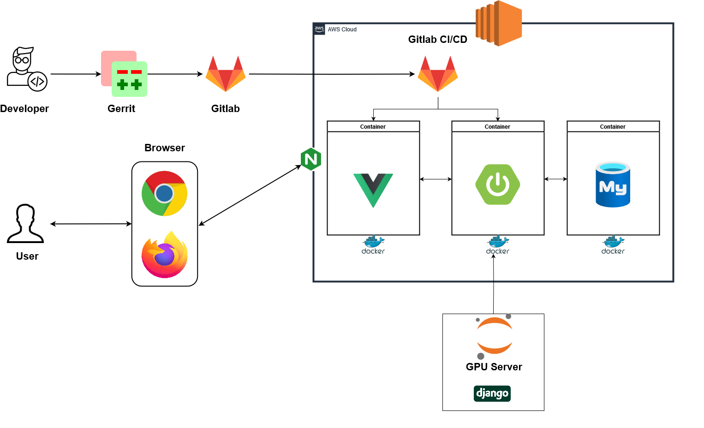